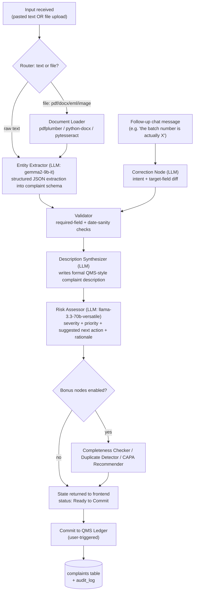

# AIVOA – AI Product Engineer Internship (Round 1)
## Build Plan: AI-Powered Customer Complaint Management System

Prepared from: assignment brief, reference UI screenshot, and frame-by-frame review of the demo video.

---

## 1. What the reference material actually shows

Watching the demo video end-to-end (not just the static screenshot) surfaces the *real* spec — the screenshot alone under-describes it:

| Observation | Detail |
|---|---|
| Two-pane layout | Left = **"Log Customer Complaint"** form (sectioned, numbered). Right = **AI copilot panel** ("AI Complaint Intake Assistant" / "AIVOA Copilot") — drag-drop + paste + chat, labelled **"Powered by LangGraph."** |
| Status badge | Top-right pill on the form: **Pending Triage** (amber) → **Ready to Commit** (green) once the AI finishes populating required fields. |
| Two intake paths | (a) Paste/type free text directly in the chat ("Apollo Pharmacy reported discolored capsules in Amoxicillin Capsules 500mg…"), or (b) drop a PDF — the copilot shows a file chip and a **live status line** ("Extracting tabular data via OCR…") before confirming extraction. |
| Field population is animated | Fields go from placeholder **"Awaiting AI extraction…"** to filled, highlighted briefly as each one lands — this is a UX signal, not just a data dump. |
| Conversational correction | User can reply in the same chat thread ("ah sorry the batch number is BMX240602 and affected quantity is 48 capsules") and the copilot updates **only those fields**, then confirms in plain language ("Got it. I have updated the Batch/Lot Number to '…' and the Affected Quantity to '…' in the form."). This is a distinct, second AI capability — targeted field patching from unstructured follow-up text — not just first-pass extraction. |
| AI Copilot Risk Assessment | A sub-panel *inside* the Defect Analysis section: **Severity (Suggested)**, **Suggested Next Action**, **Initial Risk Assessment** (a short rationale paragraph). This is generated, not user-entered, and is editable before commit. |
| Final action | A single, full-width **"Commit to QMS Ledger"** button — the metaphor is deliberate: complaints don't get "saved," they get *ledgered* (immutable, auditable), consistent with real QMS behavior. |
| Copy/labels seen in video | Sections: **1. Origin & Customer Details**, **2. Product & Batch Identification**, **3. Facility & Material Impact**, **4. Defect Analysis**. Fields: Complaint Source, Customer Name, Product Name, Product Strength, Batch/Lot Number, Affected Quantity, Manufacturing Date, Expiry Date, Originating Site Block, Impacted Non-Product Materials (NPM), Complaint Category, Complaint Description. |
| Copy/labels seen in the static screenshot (slightly different revision) | Adds an explicit **"AI Complaint Intake Assistant" BETA** panel with a **percentage extraction progress bar**, an "Ask me anything about this complaint…" free-form Q&A box, a supported-formats note (**PDF, DOCX, TXT, EML — max 10MB**), and section 4 named "Initial Assessment & Priority" (Severity + Priority dropdowns) separate from the description field. |

Because the two references disagree slightly on section boundaries, **treat the video as the source of truth for behavior** and **merge both for the field list** (union of everything seen). That merged field list is what Section 5 (data model) below is built from.

**Section naming decision:** The video uses "Facility & Material Impact" (§3) and "Defect Analysis" (§4), while the screenshot uses **"Complaint Details"** (§3) and **"Initial Assessment & Priority"** (§4). We adopt the **screenshot's labels** throughout this spec — they're more intuitive and communicate purpose more clearly to reviewers who are not pharma domain experts, which aligns with the brief's *"we are not looking for domain experts"* stance. The video's fields (Originating Site Block, Impacted NPM) are folded into Section 3 as sub-fields under Complaint Details.

### Domain primer (why these fields exist)
This is a **Customer Complaint** module inside a pharmaceutical **Quality Management System (QMS)**, for a manufacturer of **API** (Active Pharmaceutical Ingredient — the bulk drug substance) and **FDF** (Finished Dosage Form — the tablet/capsule/injectable sold to patients). In real QMS practice (ICH Q10, 21 CFR 211.198, ISO 9001/13485 patterns), a complaint record exists to:
- Capture **who/what/when** (origin, product, batch) with enough traceability to pull the batch manufacturing record.
- Assign an **initial severity/priority** so Quality can triage (a sterility complaint on an injectable ≠ a label smudge).
- Feed the **CAPA** (Corrective and Preventive Action) process — root cause → correction → prevention → effectiveness check.
- Be **ledgered immutably** for audits/regulatory inspection — hence "Commit to QMS Ledger" rather than a plain save.

The assignment explicitly says *"we are not looking for domain experts"* — so the goal isn't perfect regulatory accuracy, it's demonstrating that you understood **why** the form is shaped the way it is, which shows up in your field validation, your severity rubric, and your demo narration.

---

## 2. Mandatory tech stack (as specified) + what fills the gaps

| Layer | Technology | Notes |
|---|---|---|
| Frontend | React + Redux (Redux Toolkit) | Use RTK slices for form state + copilot chat state, not raw Redux boilerplate |
| Backend | Python + FastAPI | Async endpoints; Pydantic v2 for schema validation |
| AI orchestration | **LangGraph** | State machine for the extraction → validation → risk-assessment → correction pipeline (Section 4) |
| LLM | Groq — `gemma2-9b-it` (primary, required); `llama-3.3-70b-versatile` (heavier reasoning, optional per brief) | Free tier, no credit card — see Section 3 |
| Database | PostgreSQL (recommended over MySQL — see below) | |
| Font | Google Inter | |


**Postgres over MySQL, and why it's worth stating in your submission:** you get `pgvector` for free, which turns "Duplicate Complaint Detection" (a bonus feature) into a ~20-line feature instead of a new infra dependency. If your reviewers specifically want MySQL, the schema in Section 5 ports over 1:1 minus the vector column.

Supporting libraries (all free/open-source, no extra signup):
- `pdfplumber` / `pypdf` — text-layer PDF extraction
- `python-docx`, `email` (stdlib) — DOCX / EML parsing
- `pytesseract` + Tesseract binary — OCR fallback for scanned/image complaints (assignment explicitly says production-grade OCR is *not* required, so this is enough)
- `sentence-transformers` (`all-MiniLM-L6-v2`) — local embeddings, zero external API, for duplicate detection
- `sqlalchemy` + `alembic` — ORM + migrations
- `react-dropzone`, `axios`/RTK Query — frontend data fetching and file drop

---

## 3. External APIs — free tier only

| Service | Used for | Free tier shape | Caveat |
|---|---|---|---|
| **Groq API** | LLM calls (extraction, description synthesis, risk assessment, correction parsing) | No credit card required; rate-limited per model, org-level (roughly ~30 requests/min and a per-day cap that varies by model — `gemma2-9b-it` has a materially higher daily cap than the 70B model) | Limits change — check `console.groq.com/docs/rate-limits` before your demo so you don't hit a wall mid-recording |
| **Tesseract OCR** (local binary, not a hosted API) | Bonus: OCR on scanned/photographed complaints | Fully free, open-source, no key, no network call | Not "production-grade" but that's explicitly not required |
| **sentence-transformers (local model)** | Bonus: duplicate-complaint embeddings | Free, runs on CPU, no API key | First model download is ~90MB, do this once and cache |
| **Neon / Supabase** (pick one) | Free hosted Postgres for your demo deployment | Free tier (small storage/compute, fine for a demo dataset) | Enable `pgvector` extension if using duplicate detection |
| **Render / Railway / Fly.io** (pick one) | Free hosting for the FastAPI backend | Free tier; app sleeps when idle — wake it before recording your demo | |
| **Vercel / Netlify** | Free hosting for the React frontend | Free tier, generous for a small SPA | |
| **Google Fonts (Inter)** | Typography | Free, CDN or self-hosted | |
| **GitHub Actions** | CI (lint/test on push) — nice-to-have, signals "clean code" | Free for public repos | |

Deliberately **not** in this list: any paid OCR/document-AI service, any hosted vector DB, any email-sending service — none are required by the brief (you're told you may *fabricate* sample PDFs/emails for the demo), and every one you leave out is one less "why did you need a paid key for an intern assignment" question in the interview.

---

## 4. AI/LangGraph agent design

This is the part that most differentiates a strong submission — the brief is explicit that the LangGraph workflow needs to be **narrated end-to-end** in your demo video, so design it as a legible graph, not one giant prompt.



**Node-by-node:**

1. **Router** — cheap, no LLM needed: checks whether the request is a file upload or plain text and branches.
2. **Document Loader** — text-layer PDFs via `pdfplumber`; DOCX via `python-docx`; TXT via plain `open()`/read; EML via Python's `email` stdlib; images/scans via `pytesseract`. All four text formats shown in the screenshot (**PDF, DOCX, TXT, EML**) are supported. This matches the video's "Extracting tabular data via OCR…" status line — surface that same kind of live status to the frontend via Server-Sent Events (SSE), which FastAPI supports natively for free (no extra service).
3. **Entity Extractor** — one Groq call to `gemma2-9b-it` with a prompt that returns **strict JSON** matching your Pydantic `ComplaintExtraction` model (use Groq's JSON-mode / function-calling if available, or a "return only JSON" instruction + `json.loads` with a retry-on-parse-failure loop — don't trust free-form parsing).
4. **Validator** — pure code, no LLM: required fields present? manufacturing date < expiry date? quantity is numeric+unit? Anything missing stays `"Awaiting AI extraction…"` in the UI rather than being hallucinated.
5. **Description Synthesizer** — a second, smaller LLM call that turns the raw complaint text into the formal paragraph seen in the demo ("Apollo Pharmacy reported 12 discolored capsules in a sealed bottle. Requesting investigation and replacement.").
6. **Risk Assessor** — this is the highest-value node to get right. Give it an explicit rubric in the system prompt (e.g., *sterility/foreign-matter/mix-up → Critical; efficacy-adjacent defects → Major; cosmetic/packaging-only → Minor*) so severity suggestions are consistent and explainable rather than vibes-based — and always keep it **editable/overridable** in the UI, since a suggested severity is not a QA decision.
7. **Correction Node** — a small, separate graph entry point triggered by any *follow-up* chat message once a complaint is in-session. It should output a **diff** (which fields changed, old → new value) rather than re-running full extraction, both for cost and so you can log exactly what happened for audit purposes (see `audit_log` table below).
8. **Bonus nodes** — optional, described in Section 6.

---

## 5. Data model

```
complaints
├─ id                      (PK, e.g. "CC-2026-00154")
├─ status                  enum: pending_triage | ready_to_commit | committed
├─ complaint_source        text   (Pharmacy / Email / Distributor / Phone / Portal)
├─ customer_name           text
├─ product_name            text
├─ product_strength_grade  text
├─ batch_lot_number        text
├─ manufacturing_date      date
├─ expiry_date             date  (nullable — "Not Provided" is valid per the demo)
├─ affected_quantity       text   (free text: "48 capsules", "25 kg (1 HDPE Drum)")
├─ originating_site_block  text
├─ impacted_npm            text  (Non-Product Materials — packaging, labels, etc.)
├─ complaint_category      text
├─ complaint_date          date
├─ complaint_description   text  (AI-synthesized, user-editable)
├─ severity_suggested      text  (AI output)
├─ severity_final           text  (human-confirmed, defaults to suggested)
├─ priority                text
├─ suggested_next_action   text
├─ initial_risk_assessment text
├─ raw_source_text         text  (original pasted text, for audit)
├─ raw_source_file_path    text  (nullable, path to uploaded doc)
├─ embedding               vector(384)  -- pgvector, only if duplicate-detection bonus is built
├─ created_at / updated_at / committed_at

audit_log
├─ id
├─ complaint_id  (FK)
├─ actor          enum: ai | user
├─ field_name
├─ old_value
├─ new_value
├─ source_message  (the chat text that caused the change, if any)
├─ created_at

chat_messages
├─ id
├─ session_id / complaint_id (FK, nullable pre-commit)
├─ role   enum: user | assistant
├─ content
├─ created_at
```

The `audit_log` table is small effort, high payoff: it's exactly the kind of "product thinking" the brief says it values, and it gives you something concrete to show in the code-walkthrough video ("here's how a correction like 'actually the batch number is X' becomes a traceable, auditable event, which matters in a QMS context").

---

## 6. Bonus AI features — chosen subset

The brief lists six optional bonus features. After analytical review of domain value, implementation effort, and demo narration clarity, the following four features are selected for Phase 6. Each implements a distinct AI/ML technique and adds genuine QMS workflow value.

| Feature | Implementation Approach | Effort | Status |
|---|---|---|---|
| **AI Risk Classification** | Already built as the `risk_assessor` node (ICH Q9 rubric, Critical/Major/Minor). No additional work needed — expose rationale text in UI. | — | ✅ Already done |
| **Complaint Completeness Checker** | `SubmitChecklist` frontend component already built. Add backend `GET /complaints/{id}/completeness` endpoint to make the checklist server-authoritative. Rules-based, no LLM. | Low | 🔄 Finish |
| **Duplicate Complaint Detection** | `sentence-transformers` (`all-MiniLM-L6-v2`) generates 384-dim embedding of `complaint_description`. Stored in `pgvector` column on the `complaints` table. `GET /complaints/{id}/duplicates` endpoint performs cosine similarity search (threshold ≥ 0.85) against committed complaints. Frontend `DuplicateAlertCard` surfaces top-5 matches with similarity score. | Medium | ⏳ Build |
| **Complaint Summary** | Additional LLM call (inline in the `risk_assessor` node) generates a ≤25-word summary for list-view and dashboard rendering. Stored as `complaint_summary` column. Displayed as a subtitle chip in the complaint page header post-extraction. | Low | ⏳ Build |
| **CAPA Recommendation** | LLM node conditioned on `complaint_category` + `severity_suggested` + `initial_risk_assessment`, prompted with a rubric of CAPA types: *Critical/Sterility/Foreign Matter → Batch recall evaluation + Immediate process CAPA; Major/Discoloration → OOS investigation + Supplier audit; Packaging → Line inspection + Supplier CoA review; Minor → Trend monitoring*. Output stored as `capa_recommendation`. Frontend `CAPARecommendationCard` (purple-tinted, inside Section 4) shows CAPA type, recommended actions, and a firm disclaimer: "AI recommendation — QA Director must initiate and own CAPA". | Medium | ⏳ Build |

**Features not included and rationale:**
- **Root Cause Recommendation** — Without a corpus of historical investigation outcomes, LLM output is speculative and creates regulatory risk in a QMS demo. CAPA Recommendation (which maps complaint categories to well-known CAPA types) achieves similar narrative value with far greater defensibility. Deferred unless historical data becomes available.

**Why this set demonstrates breadth of AI/ML technique:**
- Rules engine (Completeness Checker)
- Embeddings + vector search (Duplicate Detection)
- Generative summarization (Complaint Summary)
- LLM + domain rubric (CAPA Recommendation)
- Deterministic risk scoring already in pipeline (AI Risk Classification)

**Data model additions required for Phase 6:**
```
complaints (additions)
├─ embedding          vector(384)     -- pgvector; NULL until duplicate-detection run
├─ complaint_summary  varchar(300)    -- ≤25-word AI summary for list views
├─ capa_recommendation text           -- AI-generated CAPA type + actions
```

---

## 7. Phased implementation plan

Each phase lists its goal, what you touch, and — per the brief's own framing — the **top-view working output** you should be able to show at the end of it.

### Phase 0 — Setup & research (0.5–1 day)
- Create Groq account/API key; skim `console.groq.com/docs/models` and `/docs/rate-limits`.
- Spend real time on the "before you start" research: read a summary of ICH Q10 / 21 CFR 211.198 complaint-handling requirements and the API vs FDF distinction — this shows up naturally in your field validation and severity rubric later, and you may be asked about it in interview.
- Scaffold repos: `frontend/` (Vite + React + Redux Toolkit), `backend/` (FastAPI + Poetry/uv), Postgres via Docker Compose.
- **Output:** empty app boots locally; `docker compose up` gives you Postgres; `.env.example` documents every required key.

### Phase 1 — Data layer & API skeleton (1 day)
- Implement the `complaints`, `audit_log`, `chat_messages` tables + Alembic migration.
- Build plain CRUD endpoints: `POST /complaints`, `GET /complaints/{id}`, `PATCH /complaints/{id}`, `GET /complaints`.
- **Output:** you can create/fetch/update a complaint via Swagger UI (`/docs`) with no AI involved yet — proves the foundation before layering intelligence on top.

### Phase 2 — Frontend shell matching the reference UI (1–1.5 days)
- Build the two-pane layout: numbered `SectionCard` components for the form (placeholder text "Awaiting AI extraction…"), status badge component (amber/green/gray), and the copilot panel shell (dropzone + chat thread + input) per Section 8's design spec.
- Wire Redux slices (`complaintForm`, `copilotChat`) to the Phase 1 CRUD endpoints — no LLM yet, just prove the UI can read/write a complaint record.
- **Output:** a fully clickable, on-brand UI that visually matches the reference, backed by a real (if not yet AI-populated) database record.

### Phase 3 — Core LangGraph pipeline: text intake (1.5–2 days)
- Build the graph: Router → Entity Extractor → Validator → Description Synthesizer → Risk Assessor, wired to `gemma2-9b-it` (+ `llama-3.3-70b-versatile` for the risk node if you want the stronger model there).
- Expose `POST /copilot/ingest` (accepts pasted text), have it stream progress via SSE so the frontend can show the same live "processing" feel as the demo.
- **Output:** pasting a complaint like the video's Apollo Pharmacy example auto-fills the form and flips the badge to "Ready to Commit" — this is the single most important milestone; get this rock-solid before adding anything else.

### Phase 4 — Document ingestion (1 day)
- Add the Document Loader node: PDF/DOCX/EML text extraction, `pytesseract` OCR fallback for images.
- Extend `POST /copilot/ingest` to accept `multipart/form-data` file uploads; reuse the same downstream graph.
- **Output:** dropping a fabricated complaint PDF (per the brief, you're allowed to create your own) produces the same auto-filled form, with a visible "Extracting text… / Running OCR…" status matching the demo's UX beat.

### Phase 5 — Conversational correction loop (1 day)
- Build the Correction Node and `POST /copilot/chat` endpoint; on each user message, diff intent against current complaint state, patch only the named fields, write an `audit_log` row, and return a natural-language confirmation.
- **Output:** typing "actually the batch number is X" updates just that field and the copilot replies in-thread confirming the change — matching the video's correction sequence exactly.

### Phase 6 — Bonus features (1–2 days)
- Implement Completeness Checker, Duplicate Detection (pgvector), and Complaint Summary per Section 6.
- **Output:** each bonus feature has its own visible UI surface (a checklist, a "similar complaints" list, a one-line summary chip) — don't bury them in logs only you can see.

### Phase 7 — Commit flow, polish, and testing (1–1.5 days)

#### 7a. "Commit to QMS Ledger" — detailed implementation

The commit flow is the final user-triggered action that transitions a complaint from editable draft to immutable record. This is *not* a simple save — it's a deliberate "ledger" metaphor consistent with real QMS behavior (21 CFR 211.198 requires complaint records to be auditable and tamper-evident).

**Backend endpoint: `PATCH /complaints/{id}/commit`**
1. **Pre-commit validation** — reject if any QMS-required field is still empty (ties into the Completeness Checker bonus feature). Return a structured error listing missing fields so the frontend can highlight them.
2. **Status transition** — set `status = 'committed'` and `committed_at = now()`.
3. **Severity finalization** — copy `severity_suggested` → `severity_final` if the user hasn't manually overridden it.
4. **Audit trail** — write an `audit_log` row: `actor='user', field_name='status', old_value='ready_to_commit', new_value='committed'`.
5. **Return** the locked complaint record.

**Enforcement on all subsequent endpoints:**
- `PATCH /complaints/{id}` — reject with `403 Forbidden` if `status = 'committed'` ("Committed complaints cannot be modified").
- `POST /copilot/chat` — reject corrections for committed complaints with a message: "This complaint has been committed to the QMS ledger and can no longer be modified."
- Only `GET` and `audit_log` append operations remain valid post-commit.

**Frontend behavior after commit:**
- All form fields become `disabled` / `readOnly`.
- `StatusBadge` flips to blue **"Committed"**.
- "Commit to QMS Ledger" button is replaced with a timestamp display: *"Committed on Sep 11, 2026 at 2:30 PM"*.
- Chat input area shows a locked-state message: *"This complaint has been committed to the QMS ledger."*
- A subtle success toast/notification confirms the commit action.

**Why "Commit to QMS Ledger" instead of "Save Complaint":** The screenshot shows "Save Complaint" but the video uses the "Commit" metaphor. We choose **"Commit to QMS Ledger"** because: (a) it signals immutability — the user understands this is a one-way action, (b) it aligns with real QMS practice where complaint records are ledgered for regulatory inspection, (c) it demonstrates **product thinking** — one of the four grading criteria.

#### 7b. Testing and polish
- Basic tests: a handful of `pytest` cases around the Validator and Correction Node diffing logic (cheap, and directly demonstrates "clean code" to reviewers).
- Test the commit endpoint: verify 403 on post-commit edits, verify audit_log row is written.
- Visual QA pass against the design spec in Section 8 (spacing, focus states, empty/loading/error states).
- **Output:** the full happy path — paste or upload → review/correct → commit — works without console errors, on a fresh browser profile.

### Phase 8 — Deployment & submission (0.5–1 day)
- Deploy backend (Render/Railway/Fly free tier) + frontend (Vercel/Netlify) + Postgres (Neon/Supabase free tier).
- Write the README (setup steps, architecture diagram, env vars, what's implemented vs bonus).

#### 8a. Video 1 — Working Demonstration (target: 5–7 min)
Per the brief: *"Working demonstration of all implemented AI tools and frontend features."*
- Walk through the complete happy path: open the app → paste complaint text → watch fields auto-populate → show the AI Risk Assessment panel → demonstrate a conversational correction ("the batch number is actually X") → show the field update + audit confirmation → commit to QMS ledger → show the locked state.
- Repeat with a file upload (drop a fabricated PDF) → show the extraction progress bar → fields populate.
- Demonstrate each bonus feature with its own visible UI surface (completeness checklist, duplicate detection results, summary chip).

#### 8b. Video 2 — Code Walkthrough (target: 5–7 min)
Per the brief: *"Demonstrate and explain the code by walking through the complete end-to-end workflow, starting from the user's input (prompt or PDF/email upload) in the frontend, showing the relevant frontend code, API endpoints, backend processing, AI/LangGraph workflow, and finally how the response populates the Log Customer Complaint form and AI Copilot Risk Assessment."*
- Start at the React component handling user input (dropzone / paste modal / chat input).
- Show the Redux slice dispatching the API call.
- Show the FastAPI endpoint receiving the request.
- Walk through each LangGraph node in order: Router → Document Loader → Entity Extractor → Validator → Description Synthesizer → Risk Assessor.
- Show the SSE stream returning data to the frontend.
- Show the Redux state updating and form fields populating with the animated highlight.
- End at the Commit endpoint and audit_log write.

- **Output:** submission form filled out with GitHub repo + both videos (2 separate recordings).

**Total: roughly 8–11 working days**, compressible if you cut to 1–2 bonus features instead of 3.

---

## 8. UI / design system spec (for Figma)

A consistent design system, built to be dropped straight into Figma as styles + components.

**Color tokens**
| Token | Hex | Use |
|---|---|---|
| `primary/600` | `#4F46E5` (indigo) | Primary buttons ("Commit to QMS Ledger"), active states, links |
| `primary/50` | `#EEF2FF` | Selected/hover backgrounds |
| `neutral/900` | `#111827` | Primary text |
| `neutral/500` | `#6B7280` | Secondary text, placeholders ("Awaiting AI extraction…") |
| `neutral/200` | `#E5E7EB` | Borders, dividers |
| `neutral/50` | `#F9FAFB` | Page/panel background |
| `status/amber` | `#F59E0B` (bg `#FFFBEB`) | "Pending Triage" badge |
| `status/green` | `#10B981` (bg `#ECFDF5`) | "Ready to Commit" badge |
| `status/blue` | `#3B82F6` (bg `#EFF6FF`) | "Committed" badge (post-ledger) |
| `severity/critical` | `#DC2626` | Critical severity chip |
| `severity/major` | `#F97316` | Major severity chip |
| `severity/minor` | `#EAB308` | Minor severity chip |

**Typography (Google Inter)**
| Style | Size/weight |
|---|---|
| H1 (page title, "Log Customer Complaint") | 24px / Semi Bold |
| Section label ("1. ORIGIN & CUSTOMER DETAILS") | 12px / Semi Bold / uppercase / letter-spacing 0.04em / `neutral/500` |
| Field label | 13px / Medium |
| Field value / input text | 14px / Regular |
| Chat bubble text | 14px / Regular |
| Badge text | 12px / Semi Bold |

**Spacing & grid:** 8pt base scale (4/8/12/16/24/32). Two-pane layout: left form pane ~60% width, right copilot pane ~40%, 24px gutter, both panes independently scrollable, 12px corner radius on cards, 1px `neutral/200` borders (no heavy shadows — matches the flat, clinical tone appropriate for a QA tool).

**Core components to build:**
1. `SectionCard` — numbered header + field grid (2-column on desktop, 1-column responsive). Section labels: **1. Origin & Customer Details**, **2. Product & Batch Identification**, **3. Complaint Details**, **4. Initial Assessment & Priority**.
2. `TextField` / `SelectField` / `DateField` — default, focused, filled, and **"Awaiting AI extraction…"** placeholder state (italic, `neutral/500`). For `Quantity Affected`, include an inline **unit suffix** (e.g., "kg", "capsules") displayed as a gray label on the right side of the input, matching the screenshot.
3. `StatusBadge` — variants: Pending Triage / Ready to Commit / Committed.
4. `SeverityChip` — variants: Critical / Major / Minor.
5. `ChatBubble` — user (right-aligned, `primary/600` fill, white text) vs assistant (left-aligned, `neutral/50` fill, avatar icon).
6. `Dropzone` — idle / drag-over / file-attached states. Includes "Drag & drop complaint document here or click to browse" copy.
7. `PasteTextModal` — a **dedicated button** labeled **"Paste Complaint Text / Email"** (with clipboard icon) displayed below the dropzone, separated by an **"OR" divider line**. Clicking opens a modal/expanded text area for direct text input. This is a separate intake path from the chat input.
8. `FormatInfoBox` — blue-tinted info card below the paste button: "Supported formats: PDF, DOCX, TXT, EML — Max file size: 10MB". Uses an info (ℹ) icon, `primary/50` background, `primary/600` text.
9. `ProgressBar` — determinate, with percentage label (from the screenshot's "10%" extraction indicator). Labeled **"EXTRACTION PROGRESS"** in uppercase section style.
10. `ChatBubble` — (same as #5, listed in the AI Assistant section context).
11. `AIAssessmentCard` — the nested purple-tinted card holding Severity/Next Action/Risk rationale, visually distinct from user-entered fields so it's clear it's a suggestion.
12. `PrimaryButton` (`Commit to QMS Ledger`) / `SecondaryButton` (`Reset Form`). Reset Form behavior: clears all form fields back to "Awaiting AI extraction…" state, resets status badge to "Pending Triage", clears chat history, and shows a confirmation dialog before executing ("Are you sure? This will clear all extracted data.").
13. `BetaBadge` — a small red/coral pill badge labeled **"BETA"** displayed next to the "AI Complaint Intake Assistant" title in the copilot panel header.
14. `AIDisclaimer` — fixed text below the chat input: *"AI responses may contain errors. Please verify information."* in `neutral/500`, 12px. This is a responsible-AI signal and aligns with the brief's "product thinking" grading criterion.

**Screens to design:**
1. Empty state (all fields "Awaiting AI extraction…", badge = Pending Triage, copilot panel shows dropzone + paste button + welcome message).
2. Paste-text modal open (overlay/expanded text area for pasting complaint text directly).
3. Mid-processing state (progress bar at partial %, "Analyzing document…" copilot message, fields still showing placeholders).
4. Populated / Ready to Commit state (all fields filled, AI Assessment card visible, badge = green).
5. Correction-in-progress state (chat showing a user correction + assistant confirmation, one field highlighted as just-updated).
6. Committed state (form read-only/locked, badge = blue "Committed", commit timestamp displayed, chat input disabled).

**Accessibility notes:** all status/severity color pairs above meet 4.5:1 text contrast on their tinted backgrounds; never rely on color alone for severity — always pair the chip with its text label (already true in the reference UI); dropzone and buttons need visible keyboard focus rings (`2px primary/600 outline`). The `AIDisclaimer` text must always be visible (not hidden behind a scroll) — it should be sticky/fixed at the bottom of the copilot panel. The `PasteTextModal` must be keyboard-accessible (Escape to close, focus trap while open). The `Dropzone` must announce file acceptance/rejection to screen readers via `aria-live`.

---

## 9. Mapping back to the grading signals

The brief says it values *curiosity, clean code, product thinking, and problem-solving* over a perfect app. Where each shows up in this plan:
- **Curiosity/research** → Phase 0's domain reading, reflected in the severity rubric (Section 4.6) and field validation (Section 5), not just copied into a report.
- **Clean code** → thin, single-responsibility LangGraph nodes (Section 4) instead of one mega-prompt; a few real tests (Phase 7); a documented `.env.example`.
- **Product thinking** → the `audit_log` table, the completeness checker, and treating the AI risk assessment as a *suggestion* the user can override rather than an authoritative field.
- **Problem-solving under constraint** → every external dependency in Section 3 is genuinely free-tier, and OCR/duplicate-detection are solved locally rather than reached for as paid APIs.

---

## 10. Implementation Status

*Updated automatically as phases are completed.*

| Phase | Description | Status | Completed |
|---|---|---|---|
| **Phase 0** | Setup & Scaffold — conda env, Vite+React frontend, FastAPI backend, `.env.example`, all deps installed | ✅ Done | 2026-09-11 |
| **Phase 1** | Data Layer & API Skeleton — Complaint/AuditLog/ChatMessage ORM models, Alembic, CRUD endpoints + commit endpoint | ✅ Done | 2026-09-11 |
| **Phase 2** | Frontend Shell — two-pane layout, all SRS §8 design tokens, Redux slices, all UI components (SectionCard, FormFields, StatusBadge, ChatBubble, Dropzone, PasteTextModal, ProgressBar, AIAssessmentCard) | ✅ Done | 2026-09-11 |
| **Phase 3** | Core LangGraph Pipeline (text intake) — Router → Entity Extractor → Validator → Description Synthesizer → Risk Assessor, SSE streaming, DB persistence | ✅ Done | 2026-09-11 |
| **Phase 4** | Document Ingestion — pdfplumber/docx/eml/pytesseract, multipart upload, table parsing, file persistence | ✅ Done | 2026-09-11 |
| **Phase 5** | Conversational Correction Loop — Correction Node, POST /copilot/chat, field diffing, immutable audit_log trail | ✅ Done | 2026-09-11 |
| **Phase 6** | Bonus Features — (1) Completeness Checker backend endpoint `GET /complaints/{id}/completeness`, (2) Duplicate Detection `GET /complaints/{id}/duplicates` (`pgvector` + `sentence-transformers` + `DuplicateAlertCard`), (3) Complaint Summary (LLM in `risk_assessor`, stored as `complaint_summary`, shown as header chip), (4) CAPA Recommendation (LLM + ICH Q10 rubric, stored as `capa_recommendation`, shown in `CAPARecommendationCard`) | ✅ Done | 2026-09-12 |
| **Phase 7** | Commit Flow, Polish, Testing — pytest, visual QA, field-fill animation | ⏳ Pending | — |
| **Phase 8** | Deployment — Render + Vercel + Neon, README | ⏳ Pending | — |

### Implementation Notes & Deviations

- **Database**: Using **Supabase** (hosted PostgreSQL). Alembic schema migration applied (`complaints`, `audit_log`, `chat_messages`). Connected through Supabase IPv4 connection pooler (`aws-0-ap-northeast-2.pooler.supabase.com`) with `ssl=require`.
- **LLM Engine**: Groq with `openai/gpt-oss-20b` (fast extraction, correction & synthesis) and `openai/gpt-oss-120b` (ICH Q9/Q10 risk & severity assessment) with JSON mode, replacing decommissioned `gemma2-9b-it` and `llama-3.3-70b-versatile`.
- **LangGraph State Pipeline**: Full multi-agent pipeline implemented (`router`, `document_loader`, `entity_extractor`, `validator`, `description_synthesizer`, `risk_assessor`) with conditional routing between file uploads and direct text intake.
- **Document Loader**: Extracts structured text and embedded tables across PDF (`pdfplumber`), DOCX (`python-docx`), EML/MSG (`email` standard library), plain text, and image OCR fallback (`pytesseract`).
- **File Upload & Staging**: Universal `POST /copilot/ingest` and `POST /copilot/upload` handling `multipart/form-data`, persisting uploaded files to `backend/uploads/` and recording `raw_source_file_path` on the complaint record in Supabase.
- **Conversational Correction Loop (Phase 5)**: `correction_node.py` analyzes user chat messages against active complaint state, diffing field changes (old $\rightarrow$ new value) and outputting natural confirmations or answering Q&A inquiries. `POST /copilot/chat` applies updates, writes immutable rows to `audit_log` with `actor='user'` and `source_message`, persists chat thread to `chat_messages`, and enforces 403 Forbidden immutability guard for committed complaints.
- **Frontend Live Patching**: Conversational corrections instantly update Redux form fields, flash with glowing animation (`justFilledFields`), re-calculate the QMS Submit Checklist in real time, and persist across reloads.
- **Frontend Integration**: SSE streaming consumer in `handlePasteText` and `handleFileDrop`, dynamic progress bar, yellow highlight animation on populated fields, auto-status transition to "Ready to Commit", and automated assistant chat confirmation. Tested and verified end-to-end via browser automation.
- **Package manager**: Using **conda** virtual env + pip (instead of Poetry), as requested.
- **Pharma-specific fields**: `originating_site_block` and `impacted_npm` **included** in Section 3 (Complaint Details) as optional sub-fields, matching the SRS data model.
- **Commit ID format**: `CC-YYYY-NNNNN` (e.g., `CC-2026-00154`) generated at complaint creation.
- **Frontend build**: Vite 8.3 / React 19 / Redux Toolkit 2.x. Builds clean with 0 TypeScript errors.
- **Backend**: FastAPI 0.141 + SQLAlchemy 2.0 async + LangGraph 1.2 running live on port 8000.

---