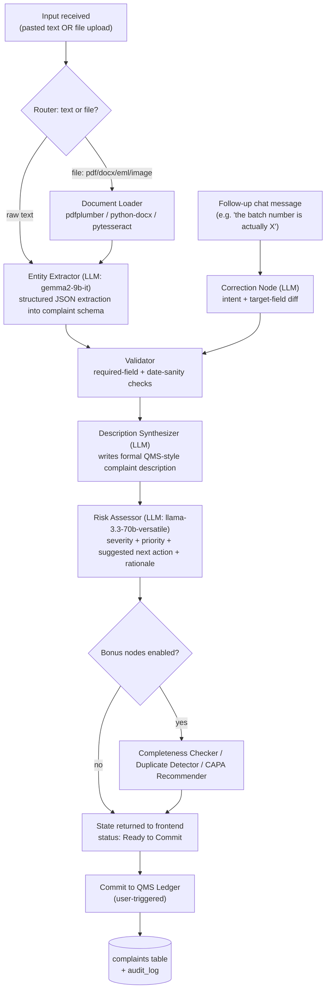

# AIVOA – AI Product Engineer Internship (Round 1)
## Build Plan: AI-Powered Customer Complaint Management System

Prepared from: assignment brief, reference UI screenshot, and frame-by-frame review of the demo video.

---

## 1. What the reference material actually shows

Watching the demo video end-to-end (not just the static screenshot) surfaces the *real* spec — the screenshot alone under-describes it:

| Observation | Detail |
|---|---|
| Two-pane layout | Left = **"Log Customer Complaint"** form (sectioned, numbered). Right = **AI copilot panel** ("AI Complaint Intake Assistant" / "AIVOA Copilot") — drag-drop + paste + chat, labelled **"Powered by LangGraph."** |
| Status badge | Top-right pill on the form: **Pending Triage** (amber) → **Ready to Commit** (green) once the AI finishes populating required fields. |
| Two intake paths | (a) Paste/type free text directly in the chat ("Apollo Pharmacy reported discolored capsules in Amoxicillin Capsules 500mg…"), or (b) drop a PDF — the copilot shows a file chip and a **live status line** ("Extracting tabular data via OCR…") before confirming extraction. |
| Field population is animated | Fields go from placeholder **"Awaiting AI extraction…"** to filled, highlighted briefly as each one lands — this is a UX signal, not just a data dump. |
| Conversational correction | User can reply in the same chat thread ("ah sorry the batch number is BMX240602 and affected quantity is 48 capsules") and the copilot updates **only those fields**, then confirms in plain language ("Got it. I have updated the Batch/Lot Number to '…' and the Affected Quantity to '…' in the form."). This is a distinct, second AI capability — targeted field patching from unstructured follow-up text — not just first-pass extraction. |
| AI Copilot Risk Assessment | A sub-panel *inside* the Defect Analysis section: **Severity (Suggested)**, **Suggested Next Action**, **Initial Risk Assessment** (a short rationale paragraph). This is generated, not user-entered, and is editable before commit. |
| Final action | A single, full-width **"Commit to QMS Ledger"** button — the metaphor is deliberate: complaints don't get "saved," they get *ledgered* (immutable, auditable), consistent with real QMS behavior. |
| Copy/labels seen in video | Sections: **1. Origin & Customer Details**, **2. Product & Batch Identification**, **3. Facility & Material Impact**, **4. Defect Analysis**. Fields: Complaint Source, Customer Name, Product Name, Product Strength, Batch/Lot Number, Affected Quantity, Manufacturing Date, Expiry Date, Originating Site Block, Impacted Non-Product Materials (NPM), Complaint Category, Complaint Description. |
| Copy/labels seen in the static screenshot (slightly different revision) | Adds an explicit **"AI Complaint Intake Assistant" BETA** panel with a **percentage extraction progress bar**, an "Ask me anything about this complaint…" free-form Q&A box, a supported-formats note (**PDF, DOCX, TXT, EML — max 10MB**), and section 4 named "Initial Assessment & Priority" (Severity + Priority dropdowns) separate from the description field. |

Because the two references disagree slightly on section boundaries, **treat the video as the source of truth for behavior** and **merge both for the field list** (union of everything seen). That merged field list is what Section 5 (data model) below is built from.

### Domain primer (why these fields exist)
This is a **Customer Complaint** module inside a pharmaceutical **Quality Management System (QMS)**, for a manufacturer of **API** (Active Pharmaceutical Ingredient — the bulk drug substance) and **FDF** (Finished Dosage Form — the tablet/capsule/injectable sold to patients). In real QMS practice (ICH Q10, 21 CFR 211.198, ISO 9001/13485 patterns), a complaint record exists to:
- Capture **who/what/when** (origin, product, batch) with enough traceability to pull the batch manufacturing record.
- Assign an **initial severity/priority** so Quality can triage (a sterility complaint on an injectable ≠ a label smudge).
- Feed the **CAPA** (Corrective and Preventive Action) process — root cause → correction → prevention → effectiveness check.
- Be **ledgered immutably** for audits/regulatory inspection — hence "Commit to QMS Ledger" rather than a plain save.

The assignment explicitly says *"we are not looking for domain experts"* — so the goal isn't perfect regulatory accuracy, it's demonstrating that you understood **why** the form is shaped the way it is, which shows up in your field validation, your severity rubric, and your demo narration.

---

## 2. Mandatory tech stack (as specified) + what fills the gaps

| Layer | Technology | Notes |
|---|---|---|
| Frontend | React + Redux (Redux Toolkit) | Use RTK slices for form state + copilot chat state, not raw Redux boilerplate |
| Backend | Python + FastAPI | Async endpoints; Pydantic v2 for schema validation |
| AI orchestration | **LangGraph** | State machine for the extraction → validation → risk-assessment → correction pipeline (Section 4) |
| LLM | Groq — `gemma2-9b-it` (primary, required); `llama-3.3-70b-versatile` (heavier reasoning, optional per brief) | Free tier, no credit card — see Section 3 |
| Database | PostgreSQL (recommended over MySQL — see below) | |
| Font | Google Inter | |
| AI-assisted coding | Gemini 2.5 Pro / ChatGPT-5 / Claude, etc. | Understand-then-adapt, not copy-paste, per the brief |

**Postgres over MySQL, and why it's worth stating in your submission:** you get `pgvector` for free, which turns "Duplicate Complaint Detection" (a bonus feature) into a ~20-line feature instead of a new infra dependency. If your reviewers specifically want MySQL, the schema in Section 5 ports over 1:1 minus the vector column.

Supporting libraries (all free/open-source, no extra signup):
- `pdfplumber` / `pypdf` — text-layer PDF extraction
- `python-docx`, `email` (stdlib) — DOCX / EML parsing
- `pytesseract` + Tesseract binary — OCR fallback for scanned/image complaints (assignment explicitly says production-grade OCR is *not* required, so this is enough)
- `sentence-transformers` (`all-MiniLM-L6-v2`) — local embeddings, zero external API, for duplicate detection
- `sqlalchemy` + `alembic` — ORM + migrations
- `react-dropzone`, `axios`/RTK Query — frontend data fetching and file drop

---

## 3. External APIs — free tier only

| Service | Used for | Free tier shape | Caveat |
|---|---|---|---|
| **Groq API** | LLM calls (extraction, description synthesis, risk assessment, correction parsing) | No credit card required; rate-limited per model, org-level (roughly ~30 requests/min and a per-day cap that varies by model — `gemma2-9b-it` has a materially higher daily cap than the 70B model) | Limits change — check `console.groq.com/docs/rate-limits` before your demo so you don't hit a wall mid-recording |
| **Tesseract OCR** (local binary, not a hosted API) | Bonus: OCR on scanned/photographed complaints | Fully free, open-source, no key, no network call | Not "production-grade" but that's explicitly not required |
| **sentence-transformers (local model)** | Bonus: duplicate-complaint embeddings | Free, runs on CPU, no API key | First model download is ~90MB, do this once and cache |
| **Neon / Supabase** (pick one) | Free hosted Postgres for your demo deployment | Free tier (small storage/compute, fine for a demo dataset) | Enable `pgvector` extension if using duplicate detection |
| **Render / Railway / Fly.io** (pick one) | Free hosting for the FastAPI backend | Free tier; app sleeps when idle — wake it before recording your demo | |
| **Vercel / Netlify** | Free hosting for the React frontend | Free tier, generous for a small SPA | |
| **Google Fonts (Inter)** | Typography | Free, CDN or self-hosted | |
| **GitHub Actions** | CI (lint/test on push) — nice-to-have, signals "clean code" | Free for public repos | |

Deliberately **not** in this list: any paid OCR/document-AI service, any hosted vector DB, any email-sending service — none are required by the brief (you're told you may *fabricate* sample PDFs/emails for the demo), and every one you leave out is one less "why did you need a paid key for an intern assignment" question in the interview.

---

## 4. AI/LangGraph agent design

This is the part that most differentiates a strong submission — the brief is explicit that the LangGraph workflow needs to be **narrated end-to-end** in your demo video, so design it as a legible graph, not one giant prompt.



**Node-by-node:**

1. **Router** — cheap, no LLM needed: checks whether the request is a file upload or plain text and branches.
2. **Document Loader** — text-layer PDFs via `pdfplumber`; DOCX via `python-docx`; EML via Python's `email` stdlib; images/scans via `pytesseract`. This matches the video's "Extracting tabular data via OCR…" status line — surface that same kind of live status to the frontend via Server-Sent Events (SSE), which FastAPI supports natively for free (no extra service).
3. **Entity Extractor** — one Groq call to `gemma2-9b-it` with a prompt that returns **strict JSON** matching your Pydantic `ComplaintExtraction` model (use Groq's JSON-mode / function-calling if available, or a "return only JSON" instruction + `json.loads` with a retry-on-parse-failure loop — don't trust free-form parsing).
4. **Validator** — pure code, no LLM: required fields present? manufacturing date < expiry date? quantity is numeric+unit? Anything missing stays `"Awaiting AI extraction…"` in the UI rather than being hallucinated.
5. **Description Synthesizer** — a second, smaller LLM call that turns the raw complaint text into the formal paragraph seen in the demo ("Apollo Pharmacy reported 12 discolored capsules in a sealed bottle. Requesting investigation and replacement.").
6. **Risk Assessor** — this is the highest-value node to get right. Give it an explicit rubric in the system prompt (e.g., *sterility/foreign-matter/mix-up → Critical; efficacy-adjacent defects → Major; cosmetic/packaging-only → Minor*) so severity suggestions are consistent and explainable rather than vibes-based — and always keep it **editable/overridable** in the UI, since a suggested severity is not a QA decision.
7. **Correction Node** — a small, separate graph entry point triggered by any *follow-up* chat message once a complaint is in-session. It should output a **diff** (which fields changed, old → new value) rather than re-running full extraction, both for cost and so you can log exactly what happened for audit purposes (see `audit_log` table below).
8. **Bonus nodes** — optional, described in Section 6.

---

## 5. Data model

```
complaints
├─ id                      (PK, e.g. "CC-2026-00154")
├─ status                  enum: pending_triage | ready_to_commit | committed
├─ complaint_source        text   (Pharmacy / Email / Distributor / Phone / Portal)
├─ customer_name           text
├─ product_name            text
├─ product_strength_grade  text
├─ batch_lot_number        text
├─ manufacturing_date      date
├─ expiry_date             date  (nullable — "Not Provided" is valid per the demo)
├─ affected_quantity       text   (free text: "48 capsules", "25 kg (1 HDPE Drum)")
├─ originating_site_block  text
├─ impacted_npm            text  (Non-Product Materials — packaging, labels, etc.)
├─ complaint_category      text
├─ complaint_date          date
├─ complaint_description   text  (AI-synthesized, user-editable)
├─ severity_suggested      text  (AI output)
├─ severity_final           text  (human-confirmed, defaults to suggested)
├─ priority                text
├─ suggested_next_action   text
├─ initial_risk_assessment text
├─ raw_source_text         text  (original pasted text, for audit)
├─ raw_source_file_path    text  (nullable, path to uploaded doc)
├─ embedding               vector(384)  -- pgvector, only if duplicate-detection bonus is built
├─ created_at / updated_at / committed_at

audit_log
├─ id
├─ complaint_id  (FK)
├─ actor          enum: ai | user
├─ field_name
├─ old_value
├─ new_value
├─ source_message  (the chat text that caused the change, if any)
├─ created_at

chat_messages
├─ id
├─ session_id / complaint_id (FK, nullable pre-commit)
├─ role   enum: user | assistant
├─ content
├─ created_at
```

The `audit_log` table is small effort, high payoff: it's exactly the kind of "product thinking" the brief says it values, and it gives you something concrete to show in the code-walkthrough video ("here's how a correction like 'actually the batch number is X' becomes a traceable, auditable event, which matters in a QMS context").

---

## 6. Bonus AI features — recommended subset

The brief lists six optional bonus features and says "additional AI features are highly appreciated" — but for an intern-scoped assignment, breadth beats depth only up to a point. Recommended priority order, each with a genuinely free approach:

| Feature | Free implementation approach | Effort |
|---|---|---|
| **Complaint Completeness Checker** | Pure validation logic (no LLM needed) — flag which QMS-required fields are still empty/low-confidence after extraction; surface as a checklist next to "Ready to Commit" | Low |
| **AI Risk Classification** | Already covered by the Risk Assessor node — just expose the rationale text, don't build it twice | Already included |
| **Duplicate Complaint Detection** | `sentence-transformers` embedding of `complaint_description` + `pgvector` cosine similarity search against existing rows; surface "3 similar complaints found" with links | Medium |
| **Complaint Summary** | One more small LLM call — a one-line summary for a list/dashboard view, cheap to add once the Description Synthesizer exists | Low |
| **CAPA Recommendation** | LLM node conditioned on `complaint_category` + `initial_risk_assessment`, prompted with a short rubric of typical CAPA types (retraining, process change, supplier audit, batch recall evaluation) | Medium |
| **Root Cause Recommendation** | Hardest to do credibly without domain data — an LLM guess here reads as the least trustworthy of the six unless clearly labeled "AI suggestion, not a finding" | Higher risk/reward |

**Recommendation:** implement Completeness Checker + Duplicate Detection + Complaint Summary as your three bonus features. They're all genuinely free, demonstrate three different AI/ML techniques (rules, embeddings/vector search, generative summarization) rather than three LLM prompts that all look the same, and are easy to narrate clearly in a 5–10 minute video.

---

## 7. Phased implementation plan

Each phase lists its goal, what you touch, and — per the brief's own framing — the **top-view working output** you should be able to show at the end of it.

### Phase 0 — Setup & research (0.5–1 day)
- Create Groq account/API key; skim `console.groq.com/docs/models` and `/docs/rate-limits`.
- Spend real time on the "before you start" research: read a summary of ICH Q10 / 21 CFR 211.198 complaint-handling requirements and the API vs FDF distinction — this shows up naturally in your field validation and severity rubric later, and you may be asked about it in interview.
- Scaffold repos: `frontend/` (Vite + React + Redux Toolkit), `backend/` (FastAPI + Poetry/uv), Postgres via Docker Compose.
- **Output:** empty app boots locally; `docker compose up` gives you Postgres; `.env.example` documents every required key.

### Phase 1 — Data layer & API skeleton (1 day)
- Implement the `complaints`, `audit_log`, `chat_messages` tables + Alembic migration.
- Build plain CRUD endpoints: `POST /complaints`, `GET /complaints/{id}`, `PATCH /complaints/{id}`, `GET /complaints`.
- **Output:** you can create/fetch/update a complaint via Swagger UI (`/docs`) with no AI involved yet — proves the foundation before layering intelligence on top.

### Phase 2 — Frontend shell matching the reference UI (1–1.5 days)
- Build the two-pane layout: numbered `SectionCard` components for the form (placeholder text "Awaiting AI extraction…"), status badge component (amber/green/gray), and the copilot panel shell (dropzone + chat thread + input) per Section 8's design spec.
- Wire Redux slices (`complaintForm`, `copilotChat`) to the Phase 1 CRUD endpoints — no LLM yet, just prove the UI can read/write a complaint record.
- **Output:** a fully clickable, on-brand UI that visually matches the reference, backed by a real (if not yet AI-populated) database record.

### Phase 3 — Core LangGraph pipeline: text intake (1.5–2 days)
- Build the graph: Router → Entity Extractor → Validator → Description Synthesizer → Risk Assessor, wired to `gemma2-9b-it` (+ `llama-3.3-70b-versatile` for the risk node if you want the stronger model there).
- Expose `POST /copilot/ingest` (accepts pasted text), have it stream progress via SSE so the frontend can show the same live "processing" feel as the demo.
- **Output:** pasting a complaint like the video's Apollo Pharmacy example auto-fills the form and flips the badge to "Ready to Commit" — this is the single most important milestone; get this rock-solid before adding anything else.

### Phase 4 — Document ingestion (1 day)
- Add the Document Loader node: PDF/DOCX/EML text extraction, `pytesseract` OCR fallback for images.
- Extend `POST /copilot/ingest` to accept `multipart/form-data` file uploads; reuse the same downstream graph.
- **Output:** dropping a fabricated complaint PDF (per the brief, you're allowed to create your own) produces the same auto-filled form, with a visible "Extracting text… / Running OCR…" status matching the demo's UX beat.

### Phase 5 — Conversational correction loop (1 day)
- Build the Correction Node and `POST /copilot/chat` endpoint; on each user message, diff intent against current complaint state, patch only the named fields, write an `audit_log` row, and return a natural-language confirmation.
- **Output:** typing "actually the batch number is X" updates just that field and the copilot replies in-thread confirming the change — matching the video's correction sequence exactly.

### Phase 6 — Bonus features (1–2 days)
- Implement Completeness Checker, Duplicate Detection (pgvector), and Complaint Summary per Section 6.
- **Output:** each bonus feature has its own visible UI surface (a checklist, a "similar complaints" list, a one-line summary chip) — don't bury them in logs only you can see.

### Phase 7 — Commit flow, polish, and testing (1 day)
- Implement "Commit to QMS Ledger": locks the record (`status = committed`, `committed_at` set), makes it read-only/append-only going forward.
- Basic tests: a handful of `pytest` cases around the Validator and Correction Node diffing logic (cheap, and directly demonstrates "clean code" to reviewers).
- Visual QA pass against the design spec in Section 8 (spacing, focus states, empty/loading/error states).
- **Output:** the full happy path — paste or upload → review/correct → commit — works without console errors, on a fresh browser profile.

### Phase 8 — Deployment & submission (0.5–1 day)
- Deploy backend (Render/Railway/Fly free tier) + frontend (Vercel/Netlify) + Postgres (Neon/Supabase free tier).
- Record the two required videos: (1) feature walkthrough, (2) code walkthrough following the exact path the brief specifies — frontend input → API endpoint → LangGraph nodes → form/risk-assessment population.
- Write the README (setup steps, architecture diagram, env vars, what's implemented vs bonus).
- **Output:** submission form filled out with GitHub repo + both videos.

**Total: roughly 8–11 working days**, compressible if you cut to 1–2 bonus features instead of 3.

---

## 8. UI / design system spec (for Figma)

A consistent design system, built to be dropped straight into Figma as styles + components.

**Color tokens**
| Token | Hex | Use |
|---|---|---|
| `primary/600` | `#4F46E5` (indigo) | Primary buttons ("Commit to QMS Ledger"), active states, links |
| `primary/50` | `#EEF2FF` | Selected/hover backgrounds |
| `neutral/900` | `#111827` | Primary text |
| `neutral/500` | `#6B7280` | Secondary text, placeholders ("Awaiting AI extraction…") |
| `neutral/200` | `#E5E7EB` | Borders, dividers |
| `neutral/50` | `#F9FAFB` | Page/panel background |
| `status/amber` | `#F59E0B` (bg `#FFFBEB`) | "Pending Triage" badge |
| `status/green` | `#10B981` (bg `#ECFDF5`) | "Ready to Commit" badge |
| `status/blue` | `#3B82F6` (bg `#EFF6FF`) | "Committed" badge (post-ledger) |
| `severity/critical` | `#DC2626` | Critical severity chip |
| `severity/major` | `#F97316` | Major severity chip |
| `severity/minor` | `#EAB308` | Minor severity chip |

**Typography (Google Inter)**
| Style | Size/weight |
|---|---|
| H1 (page title, "Log Customer Complaint") | 24px / Semi Bold |
| Section label ("1. ORIGIN & CUSTOMER DETAILS") | 12px / Semi Bold / uppercase / letter-spacing 0.04em / `neutral/500` |
| Field label | 13px / Medium |
| Field value / input text | 14px / Regular |
| Chat bubble text | 14px / Regular |
| Badge text | 12px / Semi Bold |

**Spacing & grid:** 8pt base scale (4/8/12/16/24/32). Two-pane layout: left form pane ~60% width, right copilot pane ~40%, 24px gutter, both panes independently scrollable, 12px corner radius on cards, 1px `neutral/200` borders (no heavy shadows — matches the flat, clinical tone appropriate for a QA tool).

**Core components to build in Figma:**
1. `SectionCard` — numbered header + field grid (2-column on desktop, 1-column responsive).
2. `TextField` / `SelectField` / `DateField` — default, focused, filled, and **"Awaiting AI extraction…"** placeholder state (italic, `neutral/500`).
3. `StatusBadge` — variants: Pending Triage / Ready to Commit / Committed.
4. `SeverityChip` — variants: Critical / Major / Minor.
5. `ChatBubble` — user (right-aligned, `primary/600` fill, white text) vs assistant (left-aligned, `neutral/50` fill, avatar icon).
6. `Dropzone` — idle / drag-over / file-attached states.
7. `ProgressBar` — determinate, with percentage label (from the screenshot's "10%" extraction indicator).
8. `AIAssessmentCard` — the nested purple-tinted card holding Severity/Next Action/Risk rationale, visually distinct from user-entered fields so it's clear it's a suggestion.
9. `PrimaryButton` (`Commit to QMS Ledger`) / `SecondaryButton` (`Reset Form`).

**Screens to design:**
1. Empty state (all fields "Awaiting AI extraction…", badge = Pending Triage).
2. Mid-processing state (progress bar + "Analyzing document…" copilot message).
3. Populated / Ready to Commit state (all fields filled, AI Assessment card visible, badge = green).
4. Correction-in-progress state (chat showing a user correction + assistant confirmation, one field highlighted as just-updated).
5. Committed state (form read-only/locked, badge = blue "Committed").

**Accessibility notes:** all status/severity color pairs above meet 4.5:1 text contrast on their tinted backgrounds; never rely on color alone for severity — always pair the chip with its text label (already true in the reference UI); dropzone and buttons need visible keyboard focus rings (`2px primary/600 outline`).

---

## 9. Mapping back to the grading signals

The brief says it values *curiosity, clean code, product thinking, and problem-solving* over a perfect app. Where each shows up in this plan:
- **Curiosity/research** → Phase 0's domain reading, reflected in the severity rubric (Section 4.6) and field validation (Section 5), not just copied into a report.
- **Clean code** → thin, single-responsibility LangGraph nodes (Section 4) instead of one mega-prompt; a few real tests (Phase 7); a documented `.env.example`.
- **Product thinking** → the `audit_log` table, the completeness checker, and treating the AI risk assessment as a *suggestion* the user can override rather than an authoritative field.
- **Problem-solving under constraint** → every external dependency in Section 3 is genuinely free-tier, and OCR/duplicate-detection are solved locally rather than reached for as paid APIs.

---

## What I can do next

This document is a complete spec — you (or a designer) could build the Figma file from Section 8 directly. Since you have Figma connected here, I can also **generate an actual Figma file** with these screens and components live right now, if you'd like — just say the word and which of your Figma teams/drafts folder to put it in.
