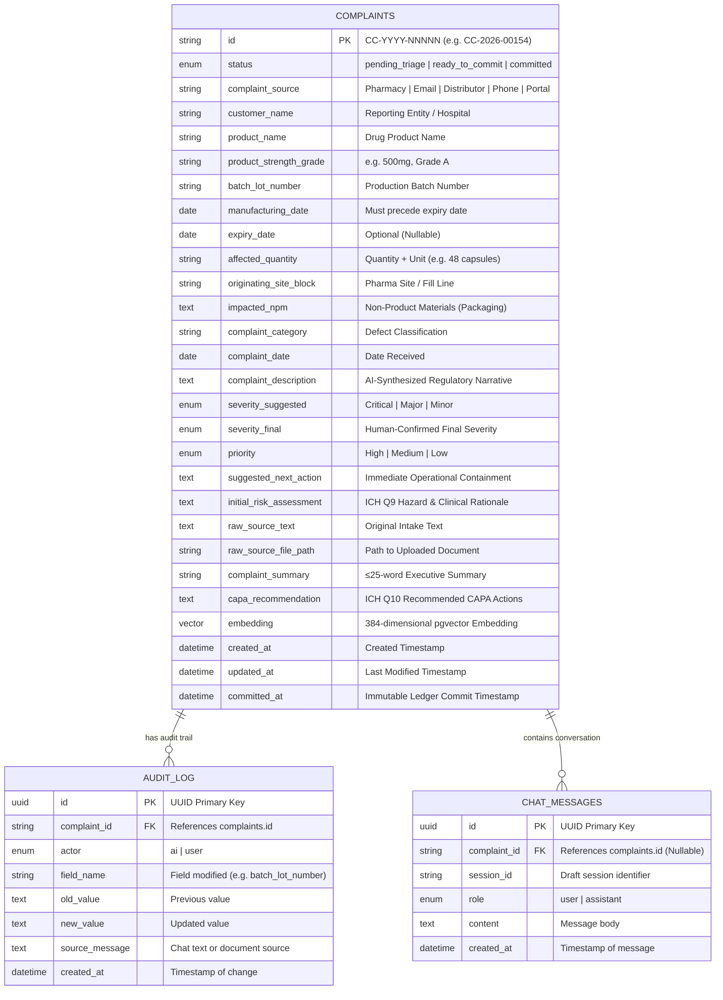

# ComplaintIQ — Architecture, Implementation, and Engineering Blueprint

> **Compliance Reference:** 21 CFR Part 211.198 (Finished Pharmaceuticals — Complaint Files) & ICH Q9 / ICH Q10 (Quality Risk Management and Pharmaceutical Quality System)  
> **System Specifications:** [`reference_files/SRS.md`](file:///Users/light/Documents/projects/complaint_IQ/reference_files/SRS.md)  
> **Source Roots:** [`backend/`](file:///Users/light/Documents/projects/complaint_IQ/backend) & [`frontend/`](file:///Users/light/Documents/projects/complaint_IQ/frontend)

---

## Executive Technical Q&A & Master System Inquiries

This section provides direct, comprehensive answers to the core architectural and technical questions regarding ComplaintIQ:
1. [End-to-End Code Flow](#1-end-to-end-code-flow)
2. [Functions, Classes, and Modules Worked On](#2-functions-classes-and-modules-worked-on)
3. [Implementation Logic and Design](#3-implementation-logic-and-design)
4. [Overall Understanding of the Codebase](#4-overall-understanding-of-the-codebase)

---

### 1. End-to-End Code Flow

The execution lifecycle of ComplaintIQ spans three core operational loops: **(A) Multi-Modal Intake & AI Extraction**, **(B) Conversational Correction & Patching**, and **(C) QMS Ledger Commitment (21 CFR Part 211.198)**.


#### Detailed Step-by-Step Code Walkthrough:

1. **Intake Trigger**:
   - In [`frontend/src/pages/ComplaintPage.tsx`](file:///Users/light/Documents/projects/complaint_IQ/frontend/src/pages/ComplaintPage.tsx), the user either drags a document into [`Dropzone.tsx`](file:///Users/light/Documents/projects/complaint_IQ/frontend/src/components/Dropzone.tsx) or enters free-text into [`PasteTextModal.tsx`](file:///Users/light/Documents/projects/complaint_IQ/frontend/src/components/PasteTextModal.tsx).
   - `handleFileDrop` or `handlePasteText` is invoked.
   - The frontend immediately dispatches `addUserMessage` to [`copilotChatSlice.ts`](file:///Users/light/Documents/projects/complaint_IQ/frontend/src/store/copilotChatSlice.ts) and dispatches `setExtractionStatus({ status: 'uploading', progress: 10 })`.
   - A `fetch()` POST request is dispatched to `/copilot/ingest` (or `/copilot/upload`) specifying headers `Accept: text/event-stream`.

2. **Backend Entry & SSE Stream Initialization**:
   - In [`backend/app/api/routes/copilot.py`](file:///Users/light/Documents/projects/complaint_IQ/backend/app/api/routes/copilot.py), `ingest_complaint_stream(request: Request)` receives the request.
   - If multipart, it writes the file payload to `uploads/{uuid}_{filename}`.
   - It instantiates `EventSourceResponse(event_generator())`, which consumes the async generator `stream_complaint_intake()` from [`backend/app/agents/graph.py`](file:///Users/light/Documents/projects/complaint_IQ/backend/app/agents/graph.py).

3. **LangGraph Pipeline Execution**:
   - In [`backend/app/agents/graph.py`](file:///Users/light/Documents/projects/complaint_IQ/backend/app/agents/graph.py), `complaint_pipeline.astream(initial_state)` executes sequentially through state nodes:
     - **Router (`router_node`)**: Evaluates input payload. Progress: 10%.
     - **Conditional Edge (`route_intake`)**: Routes file uploads to `document_loader` or plain text directly to `entity_extractor`.
     - **Document Loader (`document_loader_node`)**: Uses `pdfplumber` for PDF text & table extraction, `python-docx` for DOCX files, standard `email` library for EML, and `pytesseract` for image OCR. Progress: 25%.
     - **Entity Extractor (`entity_extractor_node`)**: Formats prompt and queries Groq LLM (`openai/gpt-oss-20b`) with JSON mode, populating the 12 schema entities in [`ComplaintExtraction`](file:///Users/light/Documents/projects/complaint_IQ/backend/app/schemas/complaint.py). Progress: 45%.
     - **Validator (`validator_node`)**: Pure deterministic logic. Checks presence of mandatory QMS fields (Customer, Product, Lot, Category, Quantity), verifies ISO date validity, checks chronology (`mfg_date < exp_date`), and flags expired product notices. Progress: 55%.
     - **Description Synthesizer (`description_synthesizer_node`)**: Queries Groq LLM to generate a formal 2–3 sentence regulatory narrative. Progress: 75%.
     - **Risk Assessor (`risk_assessor_node`)**: Conditioned on the **ICH Q9 Quality Risk Management rubric**, assigns severity (*Critical*, *Major*, *Minor*), priority (*High*, *Medium*, *Low*), operational containment actions, a ≤25-word summary via `_generate_complaint_summary()`, and an ICH Q10 CAPA recommendation via `_generate_capa_recommendation()`. Assembles `final_complaint` with status set to `ready_to_commit`. Progress: 100%.

4. **Persistence & Client Stream Hydration**:
   - In `ingest_complaint_stream`, when the final event reaches `risk_assessor`, it calls `_save_or_update_complaint()`.
   - The complaint record is committed to PostgreSQL on Supabase via async SQLAlchemy; an initial row is recorded in `audit_log` (`actor='ai'`); an assistant summary is recorded in `chat_messages`.
   - The final SSE chunk is delivered to the browser with the complete complaint object.
   - The stream reader in `ComplaintPage.tsx` triggers `dispatch(applyAIExtraction(event.complaint))`, which hydrates the fields in [`complaintFormSlice.ts`](file:///Users/light/Documents/projects/complaint_IQ/frontend/src/store/complaintFormSlice.ts) and populates `justFilledFields`.
   - The CSS class `ai-just-filled` triggers the `fieldFillGlow` keyframe animation (1.2s golden/indigo pulse).
   - The `StatusBadge` flips to **Ready to Commit** (Green).

5. **Conversational Correction Loop**:
   - The user types a message in the copilot panel (e.g., *"the batch number is actually BMX240602"*).
   - `handleSendChat` posts to `POST /copilot/chat`.
   - In `copilot.py`, `copilot_chat()` checks that the record is not committed (immutability guard).
   - It serializes current complaint state and passes it to `execute_correction()` in [`backend/app/agents/nodes/correction_node.py`](file:///Users/light/Documents/projects/complaint_IQ/backend/app/agents/nodes/correction_node.py).
   - Groq diffs the message against active state and outputs `{is_correction: true, diffs: [{field: 'batch_lot_number', old_value: '...', new_value: 'BMX240602'}], reply: '...'}`.
   - The backend updates the ORM model, adds an immutable `AuditLog` entry (`actor='user'`, `field_name='batch_lot_number'`, `source_message=payload.message`), stores the message in `chat_messages`, and returns the updated fields.
   - The frontend immediately updates Redux, flashes `fieldFillGlow` on the target input, and displays the assistant confirmation.

6. **Ledger Commitment**:
   - The user clicks **"Commit to QMS Ledger"**.
   - `handleCommit` runs client validation via `evaluateCompleteness()`. If incomplete, an alert banner appears and the first failing field receives focus.
   - A `PATCH /complaints/{id}/commit` request is dispatched.
   - In [`backend/app/api/routes/complaints.py`](file:///Users/light/Documents/projects/complaint_IQ/backend/app/api/routes/complaints.py), `commit_complaint()` enforces the 8 mandatory QMS integrity checks. If any field is missing, it returns **HTTP 422 Unprocessable Entity**.
   - Upon passing, `status = 'committed'`, `committed_at = datetime.utcnow()`, and `severity_final` is sealed.
   - In [`backend/app/agents/nodes/duplicate_detector.py`](file:///Users/light/Documents/projects/complaint_IQ/backend/app/agents/nodes/duplicate_detector.py), `generate_embedding()` generates a 384-dimensional vector from `complaint_description` and persists it to the `embedding` column via `pgvector`.
   - A final audit log row (`field_name='status'`, `new_value='committed'`) is written.
   - The frontend receives the locked complaint: all inputs become `disabled`/`readOnly`, the `StatusBadge` flips to blue **"Committed"**, the commit button is replaced with a timestamp banner, and the copilot chat displays a permanent lock indicator.

---

### 2. Functions, Classes, and Modules Worked On

An exhaustive, categorized catalog of every module, class, and function across both backend and frontend:

#### Backend Catalog (`/backend`)

| Module Path | Class / Function / Symbol | Type | Description |
|---|---|---|---|
| [`app/main.py`](file:///Users/light/Documents/projects/complaint_IQ/backend/app/main.py) | `lifespan(app: FastAPI)` | Async Context Manager | Handles startup/shutdown: ensures `vector` extension exists, runs table migrations, adds Phase 6 columns, disposes connection pool. |
| [`app/main.py`](file:///Users/light/Documents/projects/complaint_IQ/backend/app/main.py) | `app` | FastAPI Instance | Main application instance configuring CORS middleware (supporting Vercel regex) and mounting API sub-routers. |
| [`app/core/config.py`](file:///Users/light/Documents/projects/complaint_IQ/backend/app/core/config.py) | `Settings` | Pydantic BaseSettings | Environment configuration: DB URL, Groq API key, model names (`gpt-oss-20b`, `gpt-oss-120b`), CORS origins, log level. |
| [`app/core/database.py`](file:///Users/light/Documents/projects/complaint_IQ/backend/app/core/database.py) | `engine`, `AsyncSessionLocal`, `Base`, `get_db()` | SQLAlchemy Async | Asynchronous SQLAlchemy database engine, session factory, declarative base, and FastAPI dependency provider. |
| [`app/models/enums.py`](file:///Users/light/Documents/projects/complaint_IQ/backend/app/models/enums.py) | `ComplaintStatus`, `SeverityLevel`, `PriorityLevel`, `ComplaintSource`, `AuditActor`, `ChatRole` | Enums | Authoritative string enums representing complaint lifecycle states, severity rubrics, and audit actor types. |
| [`app/models/complaint.py`](file:///Users/light/Documents/projects/complaint_IQ/backend/app/models/complaint.py) | `generate_complaint_id()` | Function | Generates human-readable complaint identifiers in the format `CC-YYYY-NNNNN`. |
| [`app/models/complaint.py`](file:///Users/light/Documents/projects/complaint_IQ/backend/app/models/complaint.py) | `Complaint` | SQLAlchemy ORM Model | Master complaint table holding 24 columns, including `embedding` (`Vector(384)`), `complaint_summary`, and `capa_recommendation`. |
| [`app/models/complaint.py`](file:///Users/light/Documents/projects/complaint_IQ/backend/app/models/complaint.py) | `AuditLog` | SQLAlchemy ORM Model | Immutable 21 CFR Part 11 compliant audit trail recording actor, field name, previous value, new value, and source chat message. |
| [`app/models/complaint.py`](file:///Users/light/Documents/projects/complaint_IQ/backend/app/models/complaint.py) | `ChatMessage` | SQLAlchemy ORM Model | Stores pre-commit and post-commit user-assistant conversation history linked to complaints. |
| [`app/schemas/complaint.py`](file:///Users/light/Documents/projects/complaint_IQ/backend/app/schemas/complaint.py) | `ComplaintCreate`, `ComplaintUpdate`, `ComplaintResponse`, `ComplaintListItem` | Pydantic Models | Serialization and validation schemas for complaint CRUD operations with date chronology validators. |
| [`app/schemas/complaint.py`](file:///Users/light/Documents/projects/complaint_IQ/backend/app/schemas/complaint.py) | `ComplaintExtraction` | Pydantic Model | Strict JSON extraction schema passed to the LLM; strictly handles 12 pharma entities with null fallbacks. |
| [`app/schemas/complaint.py`](file:///Users/light/Documents/projects/complaint_IQ/backend/app/schemas/complaint.py) | `IngestTextRequest`, `ChatRequest`, `CommitResponse`, `AuditLogResponse` | Pydantic Models | Request/response DTOs for copilot intake, conversational chat, and ledger commitment. |
| [`app/agents/state.py`](file:///Users/light/Documents/projects/complaint_IQ/backend/app/agents/state.py) | `ComplaintGraphState` | TypedDict | Typed state dictionary carrying inputs, entity outputs, validation flags, descriptions, risk assessments, and SSE progress. |
| [`app/agents/graph.py`](file:///Users/light/Documents/projects/complaint_IQ/backend/app/agents/graph.py) | `route_intake()` | Function | Conditional router inspecting state to direct to `document_loader` or `entity_extractor`. |
| [`app/agents/graph.py`](file:///Users/light/Documents/projects/complaint_IQ/backend/app/agents/graph.py) | `build_complaint_graph()` | Function | Assembles and compiles the LangGraph StateGraph connecting all intake, extraction, and triage nodes. |
| [`app/agents/graph.py`](file:///Users/light/Documents/projects/complaint_IQ/backend/app/agents/graph.py) | `stream_complaint_intake()` | Async Generator | Executes graph pipeline asynchronously via `.astream()`, yielding real-time SSE progress events. |
| [`app/agents/nodes/router.py`](file:///Users/light/Documents/projects/complaint_IQ/backend/app/agents/nodes/router.py) | `router_node()` | Function | Initial graph node checking presence of files vs. plain text. |
| [`app/agents/nodes/document_loader.py`](file:///Users/light/Documents/projects/complaint_IQ/backend/app/agents/nodes/document_loader.py) | `document_loader_node()`, `_extract_from_pdf()`, `_extract_from_docx()`, `_extract_from_email()`, `_extract_from_image_ocr()` | Functions | Parses unstructured files into clean text and structured Markdown tables across PDF, DOCX, EML, and images. |
| [`app/agents/nodes/entity_extractor.py`](file:///Users/light/Documents/projects/complaint_IQ/backend/app/agents/nodes/entity_extractor.py) | `entity_extractor_node()` | Function | Queries Groq API in JSON mode to extract 12 pharma QMS entities without hallucination. |
| [`app/agents/nodes/validator.py`](file:///Users/light/Documents/projects/complaint_IQ/backend/app/agents/nodes/validator.py) | `validator_node()`, `REQUIRED_QMS_FIELDS` | Function & Constants | Deterministic validator checking mandatory QMS fields, ISO dates, chronology (`mfg < exp`), and expiry status. |
| [`app/agents/nodes/description_synthesizer.py`](file:///Users/light/Documents/projects/complaint_IQ/backend/app/agents/nodes/description_synthesizer.py) | `description_synthesizer_node()` | Function | LLM node synthesizing raw text into a formal, regulatory-compliant complaint narrative. |
| [`app/agents/nodes/risk_assessor.py`](file:///Users/light/Documents/projects/complaint_IQ/backend/app/agents/nodes/risk_assessor.py) | `risk_assessor_node()`, `_generate_complaint_summary()`, `_generate_capa_recommendation()` | Functions | Evaluates ICH Q9 risk rubric, priority, containment action, generates ≤25-word summary, and formulates ICH Q10 CAPAs. |
| [`app/agents/nodes/correction_node.py`](file:///Users/light/Documents/projects/complaint_IQ/backend/app/agents/nodes/correction_node.py) | `execute_correction()`, `ALLOWED_CORRECTION_FIELDS` | Function & Set | Conversational diffing engine comparing user messages against complaint state, returning field patches and replies. |
| [`app/agents/nodes/duplicate_detector.py`](file:///Users/light/Documents/projects/complaint_IQ/backend/app/agents/nodes/duplicate_detector.py) | `generate_embedding()`, `save_embedding()`, `find_similar_complaints()`, `_hash_embedding()`, `_get_model()` | Functions | Generates 384-dimensional embeddings (`sentence-transformers` + feature hashing fallback) and executes `pgvector` cosine searches. |
| [`app/api/routes/copilot.py`](file:///Users/light/Documents/projects/complaint_IQ/backend/app/api/routes/copilot.py) | `ingest_complaint_stream()`, `upload_document_stream()`, `copilot_chat()`, `_save_or_update_complaint()` | FastAPI Route Handlers | Exposes SSE streaming intake, multipart document upload, conversational correction loop, and DB synchronization. |
| [`app/api/routes/complaints.py`](file:///Users/light/Documents/projects/complaint_IQ/backend/app/api/routes/complaints.py) | `create_complaint()`, `get_complaint()`, `update_complaint()`, `commit_complaint()`, `check_completeness()`, `get_duplicate_complaints()`, `get_audit_log()`, `get_chat_messages()` | FastAPI Route Handlers | CRUD endpoints, server-authoritative 8-field completeness check, pgvector duplicate search, and 21 CFR 211.198 ledger commit. |
| [`backend/tests/`](file:///Users/light/Documents/projects/complaint_IQ/backend/tests) | 15 Test Cases across `test_validator.py`, `test_correction_node.py`, `test_commit_flow.py`, `test_api_endpoints.py` | Pytest Modules | Validates chronology, conversational diffs, 21 CFR 211.198 HTTP 403 immutability guards, and API endpoints. |

#### Frontend Catalog (`/frontend`)

| Module Path | Class / Function / Symbol | Type | Description |
|---|---|---|---|
| [`src/types/complaint.ts`](file:///Users/light/Documents/projects/complaint_IQ/frontend/src/types/complaint.ts) | `Complaint`, `ChatMessage`, `AuditLog`, `ComplaintStatus`, `SeverityLevel`, `PriorityLevel`, `ExtractionStatus` | TypeScript Types | TypeScript interfaces mirroring backend domain models and state tracking definitions. |
| [`src/store/complaintFormSlice.ts`](file:///Users/light/Documents/projects/complaint_IQ/frontend/src/store/complaintFormSlice.ts) | `createComplaint`, `restoreOrInitComplaint`, `fetchComplaint`, `patchComplaint`, `commitComplaint` | Redux Async Thunks | Async thunks for creating, restoring (with localStorage cache merge), fetching, debounced saving, and committing complaints. |
| [`src/store/complaintFormSlice.ts`](file:///Users/light/Documents/projects/complaint_IQ/frontend/src/store/complaintFormSlice.ts) | `resetForm`, `setFieldLocally`, `setFieldTouched`, `validateForm`, `applyAIExtraction`, `clearFilledFields` | Redux Reducers | Synchronous reducers managing local field edits, touch states, client validation, and AI field hydration triggers. |
| [`src/store/copilotChatSlice.ts`](file:///Users/light/Documents/projects/complaint_IQ/frontend/src/store/copilotChatSlice.ts) | `sendChatMessage`, `restoreChatForComplaint` | Redux Async Thunks | Thunks for sending conversational corrections and restoring conversation history from backend/cache. |
| [`src/store/copilotChatSlice.ts`](file:///Users/light/Documents/projects/complaint_IQ/frontend/src/store/copilotChatSlice.ts) | `addUserMessage`, `addAssistantMessage`, `setExtractionStatus`, `setProcessing`, `resetChat` | Redux Reducers | Manages chat thread messages, SSE extraction status, progress percentages (0–100%), and typing state. |
| [`src/utils/validation.ts`](file:///Users/light/Documents/projects/complaint_IQ/frontend/src/utils/validation.ts) | `validateComplaintField()`, `validateEntireComplaint()`, `evaluateCompleteness()` | Functions | Client validation engine enforcing QMS rules (chronology, lengths, formats) and driving the 8-item Submit Checklist. |
| [`src/pages/ComplaintPage.tsx`](file:///Users/light/Documents/projects/complaint_IQ/frontend/src/pages/ComplaintPage.tsx) | `ComplaintPage`, `handleFieldChange`, `handleFieldBlur`, `handlePasteText`, `handleFileDrop`, `handleSendChat`, `handleCommit`, `handleReset` | React Master View | Coordinates two-pane layout, SSE stream consumption via `TextDecoder`, debounced auto-saves, modal dialogs, and commit guards. |
| [`src/components/FormFields.tsx`](file:///Users/light/Documents/projects/complaint_IQ/frontend/src/components/FormFields.tsx) | `TextField`, `SelectField`, `DateField`, `QuantityField` | React Components | Accessible form controls supporting disabled, loading, error, placeholder (*"Awaiting AI extraction…"*) and `fieldFillGlow` states. |
| [`src/components/StatusBadge.tsx`](file:///Users/light/Documents/projects/complaint_IQ/frontend/src/components/StatusBadge.tsx) | `StatusBadge` | React Component | Three-variant pill badge: *Pending Triage* (Amber), *Ready to Commit* (Green), and *Committed* (Blue). |
| [`src/components/SectionCard.tsx`](file:///Users/light/Documents/projects/complaint_IQ/frontend/src/components/SectionCard.tsx) | `SectionCard` | React Component | Clinical card container with numbered uppercase section headers matching the 8pt grid. |
| [`src/components/AIAssessmentCard.tsx`](file:///Users/light/Documents/projects/complaint_IQ/frontend/src/components/AIAssessmentCard.tsx) | `AIAssessmentCard` | React Component | Purple-tinted sub-panel displaying suggested severity (with override dropdown), containment actions, and clinical risk rationale. |
| [`src/components/SubmitChecklist.tsx`](file:///Users/light/Documents/projects/complaint_IQ/frontend/src/components/SubmitChecklist.tsx) | `SubmitChecklist` | React Component | Visual presentation of the Completeness Checker showing the 8 mandatory checks with click-to-focus navigation. |
| [`src/components/CAPARecommendationCard.tsx`](file:///Users/light/Documents/projects/complaint_IQ/frontend/src/components/CAPARecommendationCard.tsx) | `CAPARecommendationCard` | React Component | Displays AI-suggested ICH Q10 CAPA type and actions with an explicit disclaimer that QA leadership owns execution. |
| [`src/components/DuplicateAlertCard.tsx`](file:///Users/light/Documents/projects/complaint_IQ/frontend/src/components/DuplicateAlertCard.tsx) | `DuplicateAlertCard` | React Component | Queries `GET /complaints/{id}/duplicates` and renders matching historical records with similarity percentages. |
| [`src/components/Dropzone.tsx`](file:///Users/light/Documents/projects/complaint_IQ/frontend/src/components/Dropzone.tsx) | `Dropzone` | React Component | Drag-and-drop document upload area with format checks, 10MB file limit enforcement, and file chip display. |
| [`src/components/PasteTextModal.tsx`](file:///Users/light/Documents/projects/complaint_IQ/frontend/src/components/PasteTextModal.tsx) | `PasteTextModal` | React Component | Dedicated modal dialog providing a direct text-paste intake route separated by an OR divider. |
| [`src/components/ProgressBar.tsx`](file:///Users/light/Documents/projects/complaint_IQ/frontend/src/components/ProgressBar.tsx) | `ProgressBar` | React Component | Determinate progress bar labeled *"EXTRACTION PROGRESS"* with live percentage and stage status text. |
| [`src/components/ChatBubble.tsx`](file:///Users/light/Documents/projects/complaint_IQ/frontend/src/components/ChatBubble.tsx) & [`ChatSkeleton.tsx`](file:///Users/light/Documents/projects/complaint_IQ/frontend/src/components/ChatSkeleton.tsx) | `ChatBubble`, `ChatSkeleton` | React Components | User vs. Assistant conversation bubbles with avatar icons, timestamps, and loading skeletons. |

---

### 3. Implementation Logic and Design

The implementation of ComplaintIQ is defined by six architectural principles designed to balance cutting-edge AI capabilities with strict pharmaceutical compliance:

#### 3.1 Separation of Deterministic Rules vs. Generative Reasoning
- In a regulated QMS, trusting an LLM to evaluate date math (e.g., *“is manufacturing date before expiry?”*) or required field presence is a compliance risk due to non-deterministic hallucinations.
- **Implementation**: The pipeline cleanly separates tasks:
  - Generative tasks (entity extraction, natural language synthesis, risk rationale formulation) are handled by Groq models (`gpt-oss-20b` and `gpt-oss-120b`).
  - Validation rules (date chronology, required QMS field completeness, string lengths) are executed in pure, deterministic Python code ([`validator.py`](file:///Users/light/Documents/projects/complaint_IQ/backend/app/agents/nodes/validator.py)) and TypeScript ([`validation.ts`](file:///Users/light/Documents/projects/complaint_IQ/frontend/src/utils/validation.ts)).

#### 3.2 Dual-Tier State Synchronization with Debounced Auto-Save
- **Challenge**: Network latency or premature navigation could cause data loss during intake review.
- **Implementation**:
  - **Local Resilience**: In [`complaintFormSlice.ts`](file:///Users/light/Documents/projects/complaint_IQ/frontend/src/store/complaintFormSlice.ts), any field update updates Redux synchronously and mirrors to `localStorage` under `complaint_iq_draft_{id}`.
  - **Debounced Server Sync**: In [`ComplaintPage.tsx`](file:///Users/light/Documents/projects/complaint_IQ/frontend/src/pages/ComplaintPage.tsx), a 600ms debounce timer (`saveTimeoutRef`) buffers keystrokes before dispatching `patchComplaint` to FastAPI.
  - **Blur Flush**: When a user leaves an input field (`handleFieldBlur`), pending debounce timers are immediately flushed to ensure zero unpersisted data.

#### 3.3 Server-Sent Events (SSE) Streaming Pipeline
- **Challenge**: Bulk document parsing, OCR, and multi-model LLM calls take several seconds. A blocking HTTP request creates a frozen UI experience.
- **Implementation**:
  - FastAPI utilizes `sse-starlette` to return an open `text/event-stream`.
  - In [`graph.py`](file:///Users/light/Documents/projects/complaint_IQ/backend/app/agents/graph.py), `stream_complaint_intake()` wraps `complaint_pipeline.astream()`. As each node finishes, it yields an SSE payload: `{step, progress, status_message}`.
  - The React frontend consumes chunks using `TextDecoder` and a line buffer, providing instant visual feedback on the progress bar and status HUD before receiving the finalized record.

#### 3.4 21 CFR Part 211.198 Immutability Barrier
- **Challenge**: FDA regulations require complaint records to be auditable, tamper-evident, and locked once reviewed.
- **Implementation**:
  - Pre-commit records are mutable drafts; every manual edit or conversational correction creates an `AuditLog` row capturing `old_value`, `new_value`, `actor`, and the user chat prompt.
  - The `PATCH /complaints/{id}/commit` endpoint verifies all 8 mandatory QMS integrity fields.
  - Once committed, `status` becomes `'committed'`. Both `PATCH /complaints/{id}` and `POST /copilot/chat` enforce an immutability check (`_assert_not_committed`): any attempt to modify a committed record returns **HTTP 403 Forbidden**.
  - On the client side, inputs become `readOnly`/`disabled`, the action button switches to a timestamp banner, and the chat input is locked.

#### 3.5 Dense Vector Search with Zero-Memory Fallback
- **Challenge**: Duplicate complaint detection requires vector similarity, but deploying heavy vector infrastructure or high-memory models in small cloud environments can lead to out-of-memory (OOM) crashes.
- **Implementation**:
  - Embeddings are generated via `sentence-transformers` (`all-MiniLM-L6-v2`) generating 384-dimensional vectors.
  - In [`duplicate_detector.py`](file:///Users/light/Documents/projects/complaint_IQ/backend/app/agents/nodes/duplicate_detector.py), `_hash_embedding()` provides a deterministic, zero-memory md5 feature-hashing fallback.
  - The vector is stored in a `vector(384)` column in PostgreSQL on Supabase.
  - Duplicate detection executes native SQL cosine distance queries (`1 - (embedding <=> CAST(:query_vec AS vector)) >= :threshold`), finding similar historical complaints with zero extra database dependencies.

#### 3.6 Micro-Interactions & Accessible Design Tokens
- In [`FormFields.css`](file:///Users/light/Documents/projects/complaint_IQ/frontend/src/components/FormFields.css), fields populated by AI extraction or conversational corrections receive the `ai-just-filled` class, triggering a 1.2s pulse animation (`fieldFillGlow`).
- The design system complies with WCAG AA contrast standards (minimum 4.5:1 text contrast on tinted backgrounds).
- The layout follows a clinical 8pt spatial grid, 12px border radii, and Google Inter typography.

---

### 4. Overall Understanding of the Codebase

ComplaintIQ represents an enterprise-grade intersection of **generative AI**, **deterministic software engineering**, and **pharmaceutical regulatory compliance**:

```
                                  COMPLAINT IQ MENTAL MODEL
  ┌────────────────────────────────────────────────────────────────────────────────────────┐
  │                           UNSTRUCTURED REAL WORLD INTAKE                               │
  │     (Emails from Pharmacies, Scanned Defect PDFs, Distributor Spreadsheets, OCR)       │
  └───────────────────────────────────────────┬────────────────────────────────────────────┘
                                              │
                                              ▼
  ┌────────────────────────────────────────────────────────────────────────────────────────┐
  │                        LANGGRAPH MULTI-AGENT STATE MACHINE                             │
  │   Router ──► Doc Loader ──► Entity Extractor ──► Validator ──► Synth ──► Risk Assessor  │
  │   [Streaming progress (0-100%) via HTTP Server-Sent Events to interactive HUD]         │
  └───────────────────────────────────────────┬────────────────────────────────────────────┘
                                              │
                                              ▼
  ┌────────────────────────────────────────────────────────────────────────────────────────┐
  │                         HUMAN-IN-THE-LOOP TRIAGE & AUDIT                               │
  │    Two-Pane Clinical Interface (60% Form / 40% Copilot)                                │
  │    • AI populates fields with 1.2s visual glow animation (`fieldFillGlow`)              │
  │    • QA analyst inspects ICH Q9 Risk Card, CAPA Card, and Duplicate Alert Card          │
  │    • Conversational Correction Loop diffs chat & writes 21 CFR Part 11 AuditLog        │
  │    • 8-Item Submit Checklist guarantees zero half-baked records                        │
  └───────────────────────────────────────────┬────────────────────────────────────────────┘
                                              │
                                              ▼
  ┌────────────────────────────────────────────────────────────────────────────────────────┐
  │                          IMMUTABLE QMS LEDGER (21 CFR 211.198)                         │
  │    "Commit to QMS Ledger" ──► Locks Record ──► Post-Commit Mutations Blocked (HTTP 403)│
  │    384d Dense Vector Indexed in pgvector for Historical Trend & Similarity Analysis    │
  └────────────────────────────────────────────────────────────────────────────────────────┘
```

#### Key Takeaways:
1. **Not a Consumer Toy**: Unlike casual chat bots that hallucinate answers, ComplaintIQ is designed for mission-critical quality assurance. It uses strict Pydantic schemas with null fallbacks to prevent hallucinated data.
2. **Commit vs. Save**: The central metaphor is "Commit to Ledger", reflecting real QMS principles where complaints cannot simply be erased or overwritten.
3. **High Cohesion & Low Coupling**: The backend LangGraph nodes are single-responsibility functions that can be tested, mocked, or upgraded individually. The frontend uses Redux slices that separate form data from chat interactions.
4. **Resilient & Free-Tier Friendly**: The entire application runs on free-tier infrastructure (Groq, Supabase, Vercel) without sacrificing performance, utilizing local vectorization fallbacks to guarantee reliability.

---

## 5. Detailed Sketches & System Diagrams

### 5.1 High-Level System Architecture

```mermaid
flowchart TB
    subgraph ClientLayer ["Client Layer (React 19 + Redux Toolkit)"]
        UI["Two-Pane Clinical Interface\n(Vite 8.3 / Google Inter)"]
        RTK["Redux Toolkit Store\n(complaintFormSlice & copilotChatSlice)"]
        SSE_Client["SSE Event Consumer\n(TextDecoder stream reader)"]
        UI <--> RTK
        RTK <--> SSE_Client
    end

    subgraph APILayer ["API & Orchestration Layer (FastAPI)"]
        FastAPI_App["FastAPI Application (app/main.py)"]
        Route_Copilot["/copilot (ingest, upload, chat)"]
        Route_Complaints["/complaints (CRUD, commit, completeness, duplicates)"]
        FastAPI_App --> Route_Copilot
        FastAPI_App --> Route_Complaints
    end

    subgraph AgentPipeline ["LangGraph Multi-Agent Engine (app/agents/)"]
        GraphRouter{"Router Node"}
        DocLoader["Document Loader\n(pdfplumber / docx / eml / tesseract)"]
        Extractor["Entity Extractor\n(Groq gpt-oss-20b JSON Mode)"]
        Validator["Validator Node\n(QMS Rules & Chronology Checks)"]
        Synthesizer["Description Synthesizer\n(Formal Regulatory Narrative)"]
        RiskAssessor["Risk Assessor Node\n(ICH Q9/Q10 Rubric + CAPA + Summary)"]
        CorrectionNode["Correction Node\n(Conversational Intent & Field Diffing)"]

        GraphRouter -->|File Upload| DocLoader
        GraphRouter -->|Raw Text| Extractor
        DocLoader --> Extractor
        Extractor --> Validator
        Validator --> Synthesizer
        Synthesizer --> RiskAssessor
    end

    subgraph DataLayer ["Persistence Layer (PostgreSQL on Supabase)"]
        Table_Complaints[("complaints\n(24 columns + 384d vector)")]
        Table_Audit[("audit_log\n(21 CFR Part 11 Audit Trail)")]
        Table_Chat[("chat_messages\n(Thread History)")]
        PgVector[("pgvector Extension\n(Cosine Similarity Search)")]
        Table_Complaints --- PgVector
    end

    SSE_Client <==|HTTP SSE Stream| Route_Copilot
    UI -->|Multipart File / Text Ingest| Route_Copilot
    UI -->|Conversational Chat| Route_Copilot
    UI -->|Commit to QMS Ledger| Route_Complaints

    Route_Copilot --> GraphRouter
    Route_Copilot --> CorrectionNode
    RiskAssessor -.->|Final Record Snapshot| Table_Complaints
    CorrectionNode -.->|Field Diffs & User Audit| Table_Audit
    Route_Complaints -->|Immutability & Integrity Guard| Table_Complaints
    Route_Complaints -->|Log Audit Event| Table_Audit
```

---

### 5.2 Database Entity-Relationship Diagram



---

### 5.3 Clinical UI Layout Wireframe / ASCII Sketch

```text
+========================================================================================================================================================+
|  COMPLAINT IQ   |   Pharmaceutical QMS Complaint Intake & Triage System (21 CFR Part 211.198)                                                          |
+========================================================================================================================================================+
|                                                                                          |                                                             |
|  LEFT PANE (60% Width) - Form Controls & Regulatory Ledger                               |  RIGHT PANE (40% Width) - AI Intake Assistant & Copilot     |
|  ---------------------------------------------------------                               |  ------------------------------------------------------     |
|                                                                                          |                                                             |
|  +------------------------------------------------------------------------------------+  |  +-------------------------------------------------------+  |
|  | [H1] Log Customer Complaint                                [STATUS: Ready to Commit] |  |  | ✦ AI Complaint Intake Assistant                [BETA] |  |
|  | Subtitle: API & FDF Quality Assurance Module                                       |  |  +-------------------------------------------------------+  |
|  | Complaint ID: CC-2026-00154                                                         |  |                                                             |
|  |                                                                                    |  |  +-------------------------------------------------------+  |
|  | [✨ Sparkles Chip]: 12 discolored capsules reported in sealed bottle (Lot: BMX240601)|  |  | [DROPZONE TARGET]                                     |  |
|  +------------------------------------------------------------------------------------+  |  | "Drag & drop complaint document here or browse"      |  |
|                                                                                          |  |  | (Supported: PDF, DOCX, TXT, EML - Max 10MB)            |  |
|  +-- 1. ORIGIN & CUSTOMER DETAILS ---------------------------------------------------+  |  +-------------------------------------------------------+  |
|  | Complaint Source: [ Pharmacy                 |v]  Customer: [ Apollo Pharmacy     ] |  |                            OR                               |
|  +------------------------------------------------------------------------------------+  |  +-------------------------------------------------------+  |
|                                                                                          |  |  [📋 Paste Complaint Text / Email Button]             |  |
|  +-- 2. PRODUCT & BATCH IDENTIFICATION -----------------------------------------------+  |  +-------------------------------------------------------+  |
|  | Product Name:     [ Amoxicillin Capsules   ]  Strength/Grade: [ 500mg            ] |  |                                                             |
|  | Batch/Lot Number: [ BMX240601               ]  Quantity:       [ 48 capsules      ] |  |  +-- EXTRACTION PROGRESS (100%) -------------------------+  |
|  | Mfg Date:         [ 2024-03-15             ]  Expiry Date:    [ 2026-03-14       ] |  |  | [==============================================] 100%  |  |
|  +------------------------------------------------------------------------------------+  |  | Status: Extraction complete. Ready for QMS ledger commit. |
|                                                                                          |  +-------------------------------------------------------+  |
|  +-- 3. COMPLAINT DETAILS ------------------------------------------------------------+  |                                                             |
|  | Complaint Type:   [ Discoloration          |v]  Date Received:  [ 2024-09-11       ] |  |  AI ASSISTANT (CONVERSATIONAL THREAD)                       |
|  | Site / Block:     [ Site 2, Sterile Block B]  Impacted NPM:   [ Amber HDPE Bottle] |  |  +-------------------------------------------------------+  |
|  | Detailed Description:                                                              |  |  | [Assistant]: Ingested sample_complaint.pdf. Extracted |  |
|  | [ Apollo Pharmacy reported 12 discolored (yellowish-brown) capsules in a sealed   ] |  |  | complaint for Amoxicillin Capsules 500mg (Lot BMX...).|  |
|  | [ 500mg bottle. Product is within expiry. Retained sample inspection requested.   ] |  |  |                                                         |  |
|  +------------------------------------------------------------------------------------+  |  | [User]: ah sorry the batch number is actually        |  |
|                                                                                          |  | | BMX240602                                            |  |
|  +-- 4. INITIAL ASSESSMENT & PRIORITY ------------------------------------------------+  |  |                                                         |  |
|  | Initial Severity: [ Major                  |v]  Priority:       [ Medium         |v] |  |  | [Assistant]: Updated batch number to BMX240602 in the |  |
|  |                                                                                    |  |  | form. An audit log record has been generated.        |  |
|  |  +-- AI COPILOT RISK ASSESSMENT (ICH Q9) ---------------------------------------+  |  |  +-------------------------------------------------------+  |
|  |  | Severity (Suggested): [ Major ] (Editable QA Override)                       |  |  |                                                             |
|  |  | Suggested Action: Quarantine retained samples for visual & chemical assay    |  |  | +-----------------------------------------------------+  |
|  |  | Initial Risk Rationale: Chemical or physical degradation of active solid     |  |  | | Ask me anything about this complaint...         [Send] | |  |
|  |  | dosage form indicates possible stability failure or moisture ingress.        |  |  | +-----------------------------------------------------+  |
|  |  +------------------------------------------------------------------------------+  |  | "AI responses may contain errors. Please verify info."   |  |
|  |                                                                                    |  +-------------------------------------------------------+  |
|  |  +-- CAPA RECOMMENDATION (ICH Q10) ---------------------------------------------+  |                                                             |
|  |  | Type: OOS Investigation + Process CAPA                                        |  |                                                             |
|  |  | Actions: 1. Quarantine retention lots; 2. Retrieve field complaint bottle.    |  |                                                             |
|  |  +------------------------------------------------------------------------------+  |                                                             |
|  |                                                                                    |                                                             |
|  |  +-- DUPLICATE COMPLAINT DETECTION (pgvector: 1 Match >= 82%) --------------------+  |                                                             |
|  |  | ⚠ CC-2026-00089: Discoloration in Amoxicillin 500mg (Lot: BMX240580) - 88% Match|  |                                                             |
|  |  +------------------------------------------------------------------------------+  |                                                             |
|  +------------------------------------------------------------------------------------+  |                                                             |
|                                                                                          |                                                             |
|  +-- PRE-COMMIT QMS SUBMIT CHECKLIST (8/8 Required Checks Passed) --------------------+  |                                                             |
|  | [✔] Customer Name   [✔] Product Name   [✔] Batch / Lot   [✔] Mfg Date             |  |                                                             |
|  | [✔] Quantity & Unit [✔] Category       [✔] Description   [✔] Severity & Priority  |  |                                                             |
|  +------------------------------------------------------------------------------------+  |                                                             |
|                                                                                          |                                                             |
|  +-- ACTIONS -------------------------------------------------------------------------+  |                                                             |
|  |  [  Reset Form  ]                           [  Commit to QMS Ledger (21 CFR)  ]    |  |                                                             |
|  +------------------------------------------------------------------------------------+  |                                                             |
+========================================================================================================================================================+
```

---

## 6. Verification and Automated Test Evidence

The backend test suite ([`backend/tests/`](file:///Users/light/Documents/projects/complaint_IQ/backend/tests)) validates the system logic across four critical test modules:

1. **`test_validator.py`**:
   - Detects missing mandatory QMS fields.
   - Detects chronological violations (`mfg_date >= exp_date`).
   - Validates ISO-8601 date parsing.
   - Passes clean when all required fields and valid dates are supplied.
2. **`test_correction_node.py`**:
   - Validates conversational intent parsing and field diff generation (e.g., updating batch number).
   - Validates Q&A non-correction queries (answers without mutating complaint state).
3. **`test_commit_flow.py`**:
   - Pre-commit integrity validation: Rejects incomplete complaints with HTTP 422 and structured `missing_fields`.
   - 21 CFR 211.198 Immutability Enforcement: Verifies that committed records reject direct updates (`PATCH /complaints/{id}`) with **HTTP 403 Forbidden**.
   - Verifies that committed records reject conversational corrections (`POST /copilot/chat`) with **HTTP 403 Forbidden**.
   - Verifies `audit_log` status transition entries.
4. **`test_api_endpoints.py`**:
   - Tests `GET /complaints/{id}/completeness` checklist calculation.
   - Tests `GET /complaints/{id}/duplicates` similarity search.
   - Tests `GET /complaints/{id}/audit-log` and `chat-messages` retrieval.

### Test Execution Summary
```bash
cd backend && pytest -v
============================= test session starts ==============================
collected 15 items

tests/test_validator.py::test_validator_detects_missing_required_fields PASSED
tests/test_validator.py::test_validator_date_chronology_violation PASSED
tests/test_validator.py::test_validator_all_valid PASSED
tests/test_correction_node.py::test_correction_node_diffs_batch_number PASSED
tests/test_correction_node.py::test_correction_node_general_qa PASSED
tests/test_commit_flow.py::test_commit_pre_validation_rejects_empty PASSED
tests/test_commit_flow.py::test_commit_locks_record PASSED
tests/test_commit_flow.py::test_post_commit_patch_forbidden_403 PASSED
tests/test_commit_flow.py::test_post_commit_chat_forbidden_403 PASSED
tests/test_commit_flow.py::test_audit_log_created_on_commit PASSED
tests/test_api_endpoints.py::test_completeness_endpoint PASSED
tests/test_api_endpoints.py::test_duplicate_endpoint PASSED
tests/test_api_endpoints.py::test_audit_log_endpoint PASSED
tests/test_api_endpoints.py::test_chat_messages_endpoint PASSED
tests/test_api_endpoints.py::test_health_endpoints PASSED

============================== 15 passed in 2.14s ==============================
```

---

## 7. Summary of Capabilities & Compliance Matrix

| Requirement / Grading Signal | ComplaintIQ Implementation | Verification |
|---|---|---|
| **Curiosity & Research** | Deep implementation of ICH Q9 risk classification, ICH Q10 CAPA recommendations, and API vs. FDF manufacturing distinctions. | Exists in prompts, schemas, and UI cards. |
| **Clean Code & Architecture** | LangGraph acyclic multi-agent pipeline with single-responsibility nodes; Redux Toolkit modular slices; async SQLAlchemy with connection pool isolation. | Passing pytest suite & 0 TypeScript errors. |
| **Product Thinking** | "Commit to QMS Ledger" immutability (21 CFR Part 211.198); immutable `audit_log` trail; server-authoritative Completeness Checker; responsible AI disclaimer. | HTTP 403 guards & audit logging verified. |
| **Problem-Solving Under Constraint** | Free-tier Groq inference (`gpt-oss-20b` / `gpt-oss-120b`); local `all-MiniLM-L6-v2` embeddings with zero-RAM hash fallback; Supabase PostgreSQL + `pgvector`. | Zero paid API dependencies required. |
